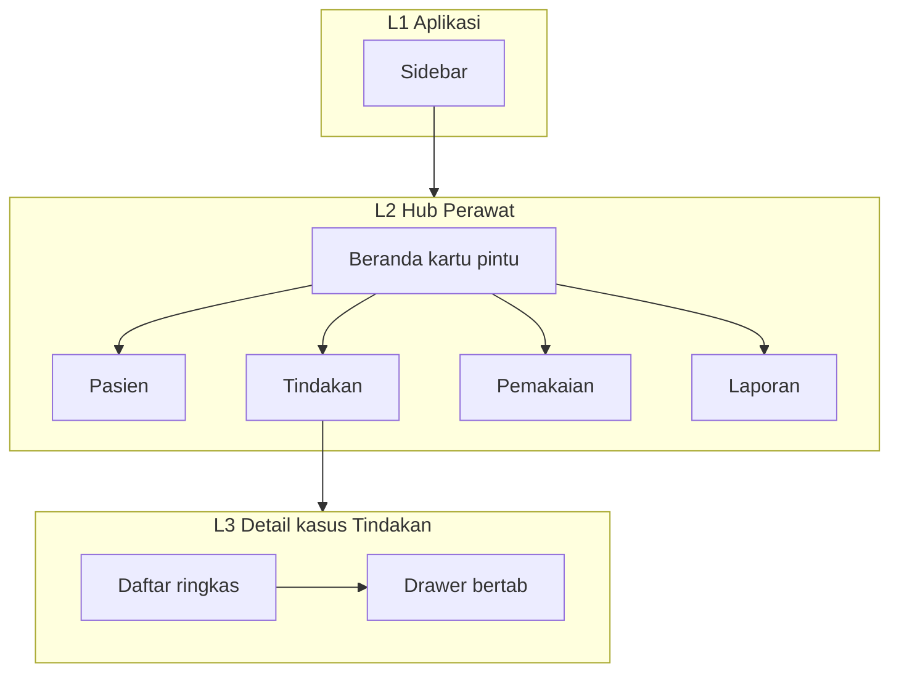
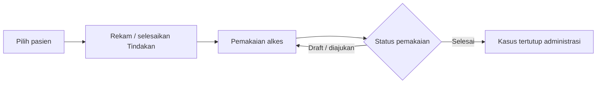
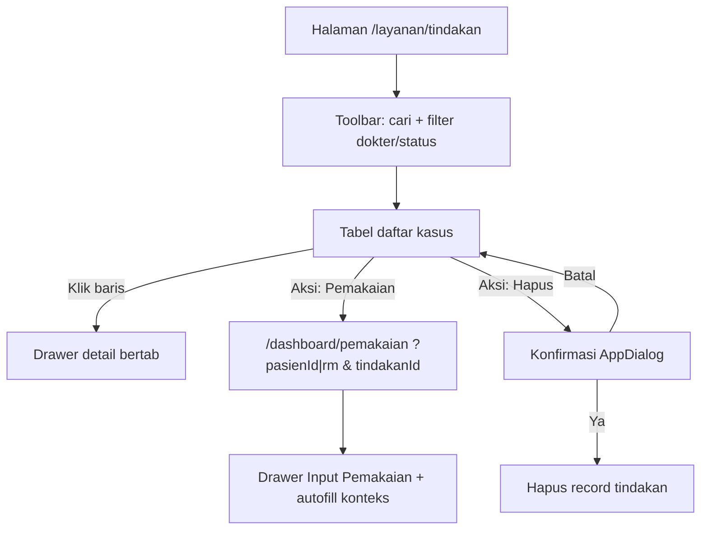
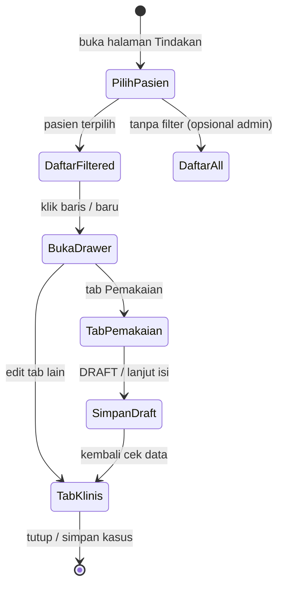
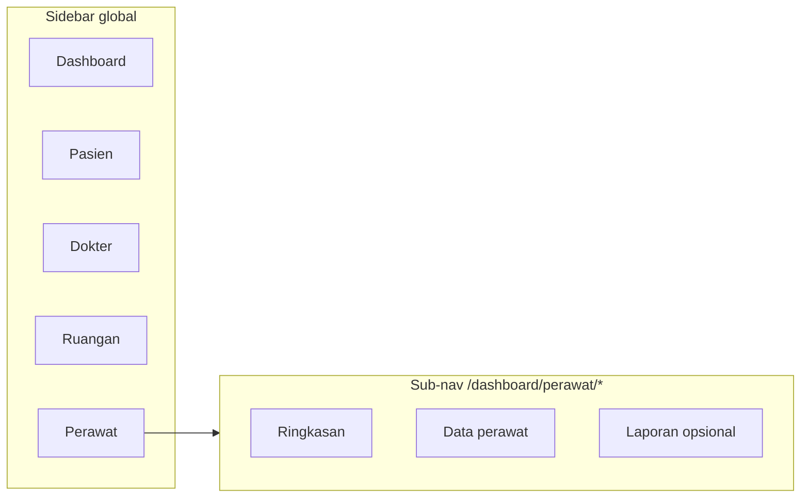
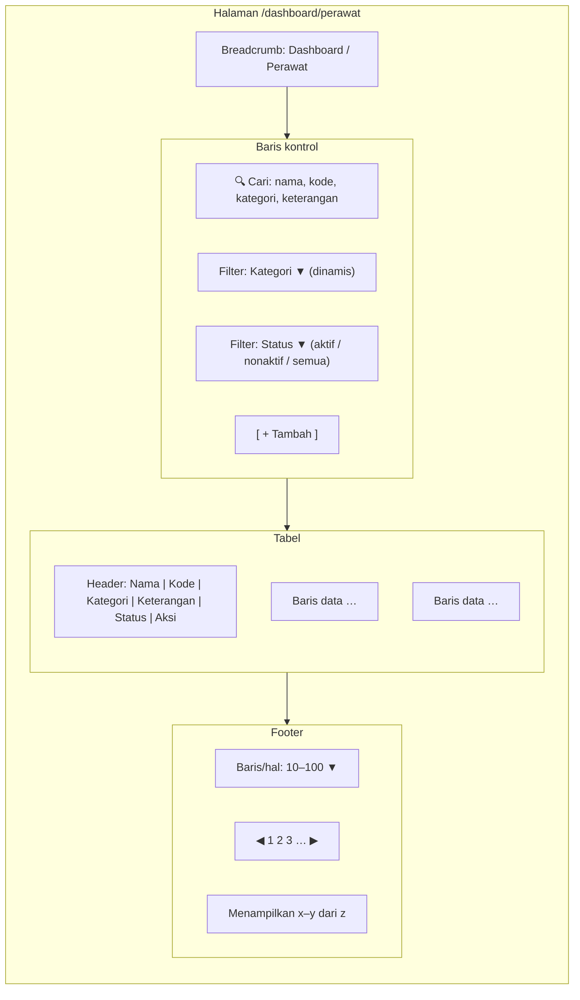
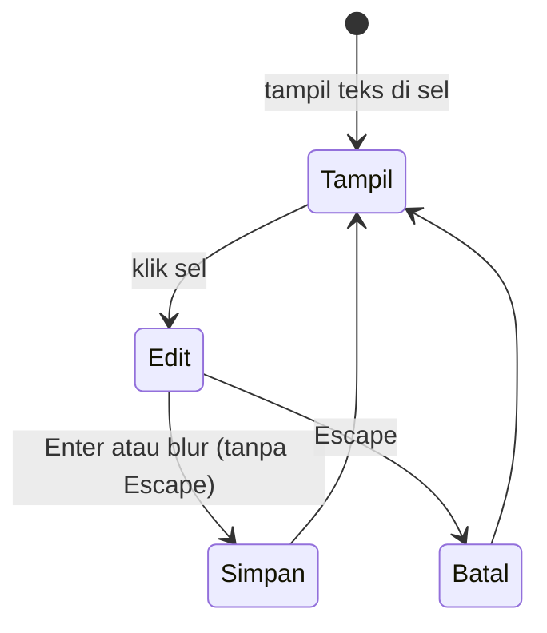
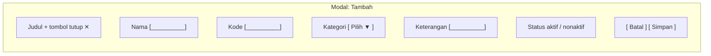
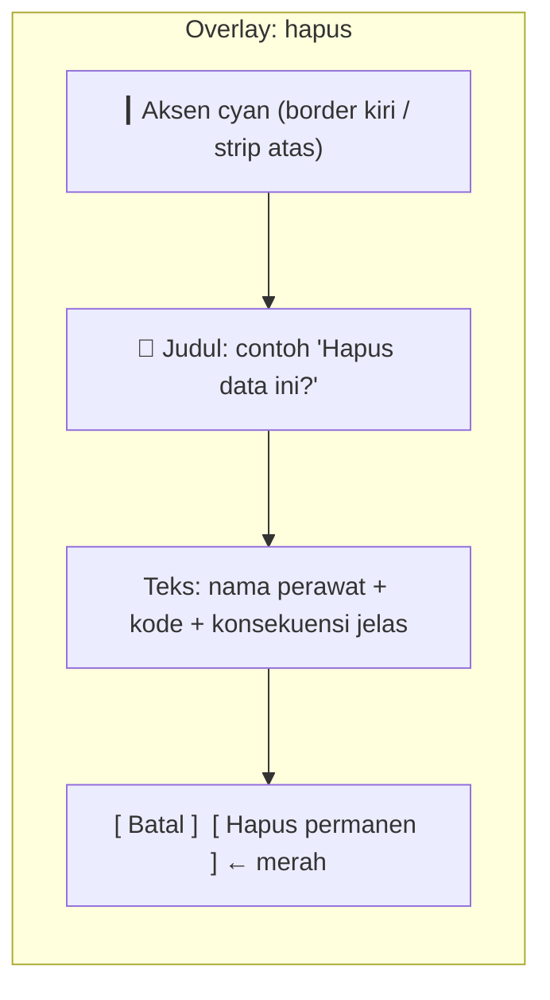

# Wireframe: `/dashboard/perawat` (editable)

File ini sengaja dibuat supaya **bisa diedit**: ubah teks di bawah, simpan, lalu preview Mermaid (mis. [Mermaid Live Editor](https://mermaid.live) atau ekstensi VS Code “Mermaid”).

**Catatan repo:** modul `/dashboard/perawat` belum ada di `app/config/menuConfig.tsx`; struktur di bawah ini **usulan** agar konsisten dengan modul lain (mis. Dokter, Ruangan).

---

## Penataan detail — modul Perawat (kompleks)

Modul perawat menyentuh **banyak domain** (pasien, prosedur, radiasi, tim, billing, alkes). Tanpa kerangka, UI menjadi padat dan alur kerja mudah putus. Bagian ini merangkum **penataan hierarki**, **pemisahan domain**, dan **aturan konsistensi** — melengkapi wireframe menu, hub operasional, dan tab Tindakan di bagian bawah dokumen.

### 1. Tiga lapisan navigasi (dari luar ke dalam)

| Lapisan | Fungsi | Contoh |
|--------|--------|--------|
| **L1 — Aplikasi** | Sidebar global, role, keluar | Masuk lewat item **Perawat** |
| **L2 — Hub tugas harian** | Beranda perawat: pintu ke Pasien, Tindakan, Pemakaian, Laporan | Satu “rumah” sebelum masuk modul berat |
| **L3 — Rekaman kasus** | Daftar tindakan + **drawer/detail** ber-tab (Pasien → … → Alkes) | Di sinilah **39 field** terurai per segment |

**Aturan:** L2 tidak menggandakan CRUD penuh; L3 tidak menampilkan 39 kolom sekaligus — hanya **ringkasan + tab/accordion**.

### 2. Pemisahan domain (agar tidak satu pot besar)

| Domain | Isi konseptual | Di mana di UI |
|--------|----------------|---------------|
| **Identitas & demografi** | Pasien (RM, nama, kontak) | Modul Pasien + tab **Pasien** di detail Tindakan |
| **Prosedur & lokasi** | Jenis tindakan, kategori, ruangan, cath | Tab **Tindakan & lokasi** |
| **Tim** | Dokter, asisten, sirkuler, logger | Tab **Dokter & tim** |
| **Radiologi / dosis** | Fluoro, dose, kv, ma | Tab **Radiologi** |
| **Klinis** | Diagnosa, severity, lab PPM | Tab **Klinis** |
| **Administrasi sesi** | No. urut, duplikat, status, kelas rawat, lama, level | Tab **Sesi & status** |
| **Keuangan** | Pembiayaan, tarif, total, KRS, selisih | Tab **Billing** |
| **Logistik medis** | Consumable, pemakaian, resume | Tab **Alkes & ringkasan** |
| **Master non-kasus** | Data tim perawat (nama/kode/kategori) | **Bukan** di hub harian — **Pengaturan / Admin** |

### 3. Fase alur kerja Cathlab (untuk copy & urutan tab)

| Fase | Fokus perawat | Tab / area yang relevan |
|------|----------------|-------------------------|
| **Pra-sesi** | Identitas pasien, persiapan ruangan, cek list | Pasien, Tindakan & lokasi (parsial) |
| **Intra-sesi** | Prosedur berjalan, tim, dosis | Tindakan & lokasi, Tim, **Radiologi** |
| **Pasca-sesi** | Status selesai, ringkasan, alkes, billing | Sesi & status, Billing, Alkes & ringkasan |

*Urutan tab di dokumen ini sudah mengikuti alur *identitas → tindakan → lokasi → tim → radiologi → klinis → admin → biaya*; bisa ditambah **wizard langkah** opsional untuk pengguna baru tanpa mengubah tab.*

### 4. Matriks: modul hub × tujuan

| Pintu hub | Tujuan utama | Risiko jika tidak ditata |
|-----------|--------------|---------------------------|
| **Pasien** | CRUD & pencarian | Duplikasi dengan tab Pasien di Tindakan — atur: **sumber kebenaran satu** (link dari Tindakan ke Pasien) |
| **Tindakan** | Satu baris = satu kasus Cathlab | Spreadsheet 39 kolom — mitigasi: **tabel ringkas + drawer bertab** |
| **Pemakaian** | Alkes habis pakai | Harus terkait **kunjungan/tindakan** bila memungkinkan (ID atau konteks) |
| **Laporan** | Bukti & audit | Scope filter **perawat / shift / ruangan** agar tidak “laporan semua rumah sakit” |

### 5. Aturan konsistensi (disiplin produk)

- **Satu istilah satu konsep** — mis. *Radiologi* vs *Dosis & sinar*: pilih satu untuk label tab, dipakai di semua tempat.
- **Field obligat vs opsional** — daftarkan per tab (wajib isi sebelum status “Selesai” bila perlu).
- **Status tindakan** — satu sumber (`TINDAKAN_STATUS` di repo); transisi jelas (Proses → Selesai).
- **Tablet** — maks ~6 tab terlihat; sisanya **Lainnya** atau baris kedua (sudah dijelaskan di § urutan tab).
- **Mobile** — prioritas: lihat daftar + isi blok kritikal (pasien + radiologi singkat); sisanya landscape atau desktop.

### 6. Prioritas implementasi (disarankan)

| Fase | Isi | Alasan |
|------|-----|--------|
| **1** | Hub Beranda + Pasien + Tindakan dengan **drawer 6 tab ringkas** + Pemakaian link | Nilai klinis terbesar dulu |
| **2** | Tab penuh 8 + validasi lintas tab + billing | Setelah alur stabil |
| **3** | Laporan scoped perawat + master tim di Pengaturan | Administrasi & audit |

### 7. Diagram hierarki (Mermaid)



---

## Saran tambahan (menunjang Dashboard / Perawat)

Di luar wireframe menu, tab Tindakan, dan penataan lapisan — berikut hal yang **memperkuat** pengalaman modul Perawat di lapangan (Cathlab).

| Area | Saran | Manfaat |
|------|--------|--------|
| **Konteks & default** | Filter default: *hari ini*, *ruangan/cath aktif*, *shift* (jika ada); ingat pilihan terakhir per perangkat | Mengurangi scroll dan salah pasien |
| **Antrian kerja** | Di Beranda atau header Tindakan: jumlah *Pending / Proses / Selesai hari ini*; klik → daftar terfilter | Orientasi cepat tanpa membuka banyak layar |
| **Pintasan** | Pencarian global (*Cmd/Ctrl+K*) ke Pasien RM / nama; pintasan ke *Tindakan baru* dari Beranda | Mengurangi klik untuk pengguna mahir |
| **Jembatan modul** | Dari baris Tindakan: *Buka pemakaian terkait* (jika ada ID); dari Pemakaian: *Lihat tindakan* | Menutup putus antara kasus dan alkes |
| **Stok & alert** | Kartu ringkas di Beranda: alkes kritis / stok menipis (jika data tersedia); link ke Pemakaian | Selaras dengan alur “setelah tindakan cek barang” |
| **Serah terima shift** | Zona opsional: ringkasan kasus belum *Selesai*, catatan singkat untuk shift berikutnya | Mengurangi informasi hilang antar shift |
| **Audit ringkas** | Di detail Tindakan: *Terakhir diubah — user, waktu* (field kritikal) | Akuntabilitas tanpa layar audit penuh |
| **Bantuan kontekstual** | Ikon `?` per tab dengan 1–2 kalimat *apa yang diisi di sini*; link ke SOP PDF internal | Onboarding perawat baru |
| **Aksesibilitas** | Target sentuh besar; kontras cukup di ruang redup; hindari hanya warna untuk status | Cathlab sering minim cahaya |
| **Performa** | Skeleton tabel; simpan draft drawer per tab (debounce) agar tidak kehilangan input saat lag | Stres jaringan tidak menghapus kerja |
| **Kebijakan hapus** | Pasien/tindakan: bedakan *batal* vs *hapus permanen*; peran siapa yang boleh | Mengurangi kesalahan irreversibel |

**Yang sengaja tidak dipaksakan di fase awal:** notifikasi push browser (izin sering ditolak); **offline penuh** (mahal) — cukup *retry* simpan + pesan jelas jika gagal.

---

## Alur bisnis utama: Pasien → Tindakan → Pemakaian

Alur yang kamu tetapkan: **pilih pasien** → **tindakan (prosedur) dilakukan** → **pencatatan pemakaian** memakai modul **Pemakaian** yang sudah dikembangkan. Ini menjadi **tulang punggung** hub Perawat; urutan menu (Pasien → Tindakan → Pemakaian) mengikuti alur ini.

### Rangka langkah (konseptual)

| Langkah | Modul / route | Apa yang terjadi |
|--------|----------------|------------------|
| **1. Pilih pasien** | `/dashboard/pasien` (atau combobox di layar lain) | Identitas pasien terikat ke sesi kerja (RM, nama). Bisa juga dipilih dari **PasienCombobox** di alur Pemakaian. |
| **2. Tindakan dilakukan** | `/dashboard/layanan/tindakan` | Rekam kasus Cathlab (drawer bertab / detail): prosedur, tim, radiologi, status, dll. Field `pemakaian` di skema tindakan bisa merujuk ringkasan teks atau **ID pemakaian** jika diintegrasikan. |
| **3. Pemakaian (modul existing)** | `/dashboard/pemakaian` | Input **alkes / consumable** untuk kasus yang sama: pasien, dokter, ruangan, barang/variant, template (komponen & obat-alkes), status alur **DRAFT → … → SELESAI**, cetak template angiografi, dll. |

**Prinsip:** satu **konteks pasien** mengalir dari langkah 1 ke 3; idealnya **ID pasien** (dan jika ada **ID tindakan / kunjungan**) diserahkan antar modul agar tidak mengetik ulang.

### Diagram alur (Mermaid)



### Versi linear (untuk copy UI / onboarding)

```
  Pasien ──► Tindakan medis ──► Pemakaian (allocate / template / verifikasi)
                │                      │
                └──── konteks sama ────┘   (RM, sesi, ruangan)
```

### Kaitan dengan implementasi repo (ringkas)

- **`app/dashboard/pemakaian/page.tsx`** — sudah memakai **`PasienCombobox`**, **`DoctorCombobox`**, **`RuanganCombobox`**, **`BarangVariantCombobox`**, template lokal, status **DRAFT … SELESAI**, dialog scan, cetak consumable angiografi.
- **Tindakan** — data kasus di **`/dashboard/layanan/tindakan`** (bridge `tindakan`, skema ~39 field via `TindakanTable` + adapter).
- **Jembatan ke Pemakaian (terpasang):** dari tabel Tindakan, kolom **Aksi → Pemakaian** membuka **`/dashboard/pemakaian`** dengan query **`pasienId`** (atau **`rm`** bila tidak ada UUID) + **`tindakanId`**. Halaman Pemakaian memuat master bila ada parameter itu, **membuka drawer Input Pemakaian otomatis**, mengisi pasien/dokter/ruangan/catatan konteks dari kasus (fetch **`GET /api/tindakan/[id]`** bila `tindakanId` ada). Konfirmasi hapus kasus memakai **`AppDialogProvider`** (bukan `window.confirm`).

### Wireframe ASCII — satu alur di Beranda Perawat

```
  ┌──────────────┐     ┌──────────────┐     ┌─────────────────────┐
  │   Pasien     │ ──► │   Tindakan   │ ──► │ Pemakaian (existing) │
  │  pilih / cek │     │  rekam kasus │     │  alkes & status      │
  └──────────────┘     └──────────────┘     └─────────────────────┘
```

### Alur layar modul Tindakan (`/dashboard/layanan/tindakan`)

Ringkasan **alur operasional** perawat di layar ini (selaras implementasi: `TindakanDashboard` → `TindakanTable` + drawer).

| Tahap | Perilaku user | Hasil di UI |
|--------|----------------|-------------|
| **Masuk** | Buka menu **Layanan → Tindakan** (route di atas) | Header (judul + **filter pasien aktif** lewat combobox) + ringkasan angka + **Daftar kasus tindakan**. |
| **Saring / cari** | Isi kotak cari; pilih dokter / status di toolbar | Tabel memuat subset baris (haystack JSON per baris + filter dropdown). |
| **Baca kasus** | **Klik satu baris** (bukan tombol Aksi) | **Drawer detail bertab** terbuka (domain: Pasien, Tindakan, Tim, Radiologi, Klinis, Sesi & biaya, + jembatan Pemakaian sesuai wireframe komponen). |
| **Input alkes terkait kasus** | Klik **Pemakaian** di kolom **Aksi** | Navigasi ke **`/dashboard/pemakaian?…`**; drawer Pemakaian terbuka dengan konteks pasien + (opsional) isian dari **`tindakanId`**. |
| **Hapus salah input / duplikat** | Klik **Hapus** di kolom **Aksi** | **Dialog konfirmasi in-app** (tema JARVIS / `AppDialog`); jika ya → baris dihapus di DB (`tindakan`) + notifikasi sukses/gagal. |

**Kolom tabel (ringkas):** Tanggal · RM · Nama pasien · Dokter · Tindakan · Status · **Aksi** (Pemakaian, Hapus).

#### Diagram alur di layar Tindakan (Mermaid)



#### Deep link & query (konsisten dengan § konvensi URL di bawah)

- **Dari Tindakan ke Pemakaian:** minimal sertakan **`tindakanId`** + **`pasienId`** atau **`rm`** agar resolver pasien dan konteks kasus lengkap.
- **Perilaku Pemakaian:** bila URL berisi **`pasienId`**, **`rm`**, atau **`tindakanId`**, master (dokter, pasien, barang) dimuat lebih awal dan drawer input **dibuka sekali** per kombinasi query (menutup drawer tidak membuka ulang sampai query berubah).

---

## Perilaku Tindakan + tab Pemakaian (satu pasien terpilih)

Diskusi produk: **satu pasien** menjadi **konteks aktif** di layar Tindakan; **Pemakaian** tidak lagi “modul terpisah di kepala user” saja, tetapi **satu tab** di dalam detail kasus (drawer/halaman) sehingga alur *tindakan → alkes* dalam satu tempat. Implementasi teknis bisa **embed** komponen dari modul Pemakaian yang sudah ada atau **ringkasan + buka layar penuh** — perilaku UX di bawah ini mengikat keduanya.

### Prinsip perilaku

| Aturan | Penjelasan |
|--------|------------|
| **Satu pasien terpilih** | Sebelum user fokus merekam tindakan bermakna, **pasien aktif** harus dipilih (combobox header, atau datang dari URL `?pasien=` / alur Pasien). Daftar baris tindakan bisa **difilter ke pasien itu saja**; baris baru otomatis mengisi field pasien dari konteks. |
| **Satu kasus = satu drawer** | Klik baris → drawer/detail membuka **satu rekaman tindakan**; semua tab (termasuk Pemakaian) menyandang **ID pasien + ID tindakan** yang sama. |
| **Tab Pemakaian** | Isinya **pencatatan pemakaian alkes** untuk pasien & kasus tersebut: sama dengan domain modul `/dashboard/pemakaian` (status DRAFT→SELESAI, template, barang), tetapi **pasien tidak boleh diganti** di tab ini (kunci UI atau disembunyikan). |
| **Sinkron field teks** | Field `consumable` / `pemakaian` / `resume` di skema tindakan bisa tetap ada sebagai **ringkasan** atau diisi otomatis dari ringkasan order di tab Pemakaian (arah integrasi data). |

### Perilaku layar daftar Tindakan (ringkas)

1. **Header halaman** — area **“Pasien aktif: [ combobox ▼ ]”** + opsi **Hapus pilihan** (kembali ke semua pasien / mode admin).  
2. **Tanpa pasien dipilih** — tampilkan pesan ringkas *“Pilih pasien untuk menambah tindakan baru”* atau tampilkan semua baris (sesuai kebijakan); tombol **+ Baru** nonaktif sampai pasien dipilih **atau** mengarahkan ke pilih pasien dulu.  
3. **Dengan pasien dipilih** — tabel hanya baris untuk RM tersebut (filter); **+ Baru** membuat baris baru dengan pasien terisi.  
4. **Deep link** — `/dashboard/layanan/tindakan?pasienId=…` memuat combobox ke pasien tersebut.

### Tab di dalam drawer / detail (dengan Pemakaian)

Urutan disarankan: tab klinis dulu, **Pemakaian** setelah **Radiologi** atau sebelum **Billing** (alkes sebelum rupiah). Contoh urutan **9 tab** (varian penuh):

`Pasien · Tindakan & lokasi · Dokter & tim · Radiologi · Klinis · Sesi & status · Pemakaian · Billing · Ringkasan`

- **Tab “Alkes & ringkasan”** versi sebelumnya bisa **digabung** ke **Tab Pemakaian** (modul) + satu blok teks **Resume** di bawah jika perlu.  
- **Varian tablet:** gabung *Billing + Ringkasan* atau *Pemakaian* full width dengan sub-scroll.

### Isi tab Pemakaian (dua tingkat — diskusi)

| Tingkat | Perilaku |
|---------|----------|
| **A — Ringkas** | Daftar order pemakaian terkait `tindakan_id` / pasien + tanggal; tombol **“Kelola di halaman Pemakaian”** membuka `/dashboard/pemakaian?…` dengan query terisi. |
| **B — Lengkap** | Menyematkan **alur yang sama** dengan `page.tsx` Pemakaian (combobox dokter/ruangan, template, status) dalam panel tab; **pasien locked**. Lebih berat secara UI tapi satu layar. |

### Diagram perilaku (Mermaid)



### Wireframe ASCII — halaman daftar + pasien aktif

```
┌─────────────────────────────────────────────────────────────────────────────┐
│ TINDAKAN MEDIS                                                               │
│ Pasien aktif: [ Dewi Lestari · RM 123456 ▼ ]  [× Hapus filter]    🔍 Cari…   │
├─────────────────────────────────────────────────────────────────────────────┤
│ Tanggal   │ RM      │ Nama pasien   │ Dokter │ Tindakan │ Status │          │
│ (filter hanya baris pasien terpilih — atau semua jika admin)                 │
└─────────────────────────────────────────────────────────────────────────────┘
```

### Wireframe ASCII — drawer detail dengan tab Pemakaian

```
┌──────────────────────────────────────────────────────────────────────────────┐
│ RM 123456 · Dewi Lestari · PCI · Proses                         [ Tutup ]   │
├──────────────────────────────────────────────────────────────────────────────┤
│ [ Pasien ] [ Tindakan & lokasi ] [ Tim ] [ Radiologi ] [ Klinis ] [ Sesi ] │
│ [ Pemakaian ] [ Billing ] [ Ringkasan ]   ← Pemakaian = modul alkes         │
│ ═══════════                                                                  │
│ TAB: PEMAKAIAN (pasien terkunci — tidak bisa ganti)                          │
│                                                                              │
│   Status order: DRAFT   [ Ajukan ] …                                       │
│   Dokter / Ruangan: (sama dengan kasus atau override jika kebijakan)         │
│   ┌ Template komponen / obat-alkes (sesuai modul Pemakaian yang ada) ─────┐  │
│   │  Baris barang · qty · …                                              │  │
│   └──────────────────────────────────────────────────────────────────────┘  │
│   [ Buka halaman Pemakaian penuh ↗ ]  (opsional jika tab ringkas saja)       │
└──────────────────────────────────────────────────────────────────────────────┘
```

### Wireframe ASCII — mobile (tab scroll + aksi laporan)

**Riwayat pasien** ditampilkan sebagai **laporan resmi** (kop RS, periode, ringkasan tindakan & pemakaian); dari layar itu user bisa **cetak** dan **kirim WhatsApp** (teks ringkas + tautan PDF atau lampiran sesuai kebijakan IT).

```
┌─────────────────────────────┐
│ ←  Tindakan    RM 123456    │
│ [ Laporan ] [ WA ] [ Print ] │  ← aksi global (pasien aktif / drawer)      │
│ ◀ Pas·Tin·Tim·Rad·…·Riwayat▶│  ← tab Riwayat = laporan & histori terformat │
│ ┌─────────────────────────┐ │
│ │ (isi tab: mis. Pemakaian)│ │
│ └─────────────────────────┘ │
└─────────────────────────────┘
```

**Varian — layar khusus “Laporan riwayat pasien” (full mobile):**

```
┌─────────────────────────────┐
│ ←  Laporan resmi · RM 123456 │
├─────────────────────────────┤
│ ┌ RS … Kop surat (preview) ┐ │
│ │ Ringkasan tindakan &      │ │
│ │ pemakaian (periode …)     │ │
│ │ Ttd / barcode (opsional)  │ │
│ └───────────────────────────┘ │
│ [ Kirim ke WhatsApp ] [ Print ] [ Unduh PDF ]                               │
└─────────────────────────────┘
```

### Perilaku: laporan resmi · WhatsApp · cetak

| Fitur | Perilaku (usulan) |
|-------|---------------------|
| **Laporan resmi** | Satu dokumen terstruktur per **pasien terpilih**: daftar tindakan + pemakaian terkait (filter tanggal), kop lembar RS, nomor dokumen/versi jika perlu. Bisa dihasilkan **HTML preview** lalu **PDF** untuk arsip. |
| **Print** | `window.print()` pada preview **atau** cetak langsung dari PDF; styling `@media print` (sembunyikan tombol navigasi). |
| **Kirim WhatsApp** | Membuka `https://wa.me/<nomor>?text=<encoded>` dengan **ringkasan teks** + opsi **tautan unduhan PDF** (jika file di-host); **nomor** dari `no_telp` pasien/wali (validasi format 62…). Untuk PHI sensitif, ikuti **kebijakan rumah sakit** (tidak mengirim data penuh di chat tanpa persetujuan). |
| **Letak di UI** | Tombol di **header** saat pasien aktif; **tab Riwayat** untuk preview laporan + histori; drawer detail bisa punya menu **“… ”** berisi Laporan / WA / Print yang sama. |

*Ini spesifikasi perilaku + wireframe untuk diselaraskan dengan implementasi; modul `pemakaian/page.tsx` tetap sumber fitur, tab hanya menambah **konteks pasien+tindakan**.*

### Konvensi query string (Next.js App Router) — usulan

Di repo, **`/dashboard/pemakaian`** dan **`/dashboard/layanan/tindakan`** belum memakai pola query terstandarisasi di tingkat dokumen ini; berikut **konvensi yang disarankan** agar deep link dari tab Tindakan, Beranda Perawat, dan modul Pasien konsisten.

| Parameter | Contoh nilai | Dipakai di | Fungsi |
|-----------|----------------|------------|--------|
| `pasienId` | UUID (`uuid`) | Tindakan, Pemakaian, Perawat | Kunci utama pasien di DB (disarankan sebagai **sumber utama**). |
| `rm` | string (`"123456"`) | Tindakan, Pemakaian | Alternatif jika UI/legacy lebih sering pakai **No. RM**; resolver server/client mengaitkan ke `pasienId`. |
| `tindakanId` | UUID / bigint string | Pemakaian, (link balik) | Mengikat order pemakaian ke **satu baris kasus** tindakan. |
| `orderId` | UUID | Pemakaian | Jika satu tab membuka **satu order** yang sudah ada (bukan order baru). |

**Contoh URL (editable):**

```
/dashboard/layanan/tindakan?pasienId=<uuid>
/dashboard/layanan/tindakan?rm=123456
/dashboard/pemakaian?pasienId=<uuid>&tindakanId=<uuid>
/dashboard/pemakaian?pasienId=<uuid>&tindakanId=<uuid>&orderId=<uuid>
```

**Aturan:**

- **Jangan** memakai `pasienId` dan `rm` bersamaan kecuali untuk migrasi; prioritas **`pasienId`** jika keduanya ada.
- Tombol *“Buka Pemakaian penuh”* dari drawer: `router.push(\`/dashboard/pemakaian?pasienId=${id}&tindakanId=${tid}\`)`.
- Tab **Pemakaian** di dalam drawer membaca query yang sama jika di-embed sebagai route **nested** (`?tab=pemakaian`) atau state internal — opsi URL: `...tindakan/[id]?tab=pemakaian` (path) vs query (lebih mudah untuk bookmark).

**Implementasi Next.js (ringkas):**

- **Server `page.tsx`:** prop `searchParams` (App Router) untuk membaca query di server.
- **Client component:** `useSearchParams()` dari `next/navigation`; bungkus dengan **`<Suspense>`** bila halaman statis perlu kompatibilitas (sesuai pola Next 14+).
- **Satu sumber kebenaran pasien aktif:** sinkronkan combobox header dengan `pasienId` dari URL (`useEffect` saat `searchParams` berubah).

---

## Struktur menu Dashboard / Perawat

### Isi menu (usulan)

| Lapisan | Isi | Catatan |
|--------|-----|--------|
| **Sidebar (global)** | Satu item **Perawat** → `/dashboard/perawat` | Grup **Main**, ikon mis. siluet/orang-bantu (setara Pasien/Dokter) |
| **Sub-nav (lokal di halaman)** | **Ringkasan** · **Data perawat** · **Laporan** (opsional) | Mirip sub-tab di halaman Dashboard utama; hanya mengubah konten, sidebar tetap |

**Ringkasan** — kartu ringkas: jumlah perawat aktif/nonaktif, distribusi per kategori (bisa placeholder grafik).  
**Data perawat** — layar utama sesuai wireframe §1–5 (tabel, filter, inline edit, modal tambah, hapus).  
**Laporan** — ekspor (CSV/PDF) + filter rentang/status; opsional jika tidak dipakai fase pertama.

**URL (editable):**

- `/dashboard/perawat` → landing **Ringkasan** (atau redirect ke **Data** jika ringkasan ditunda).
- `/dashboard/perawat/ringkasan`
- `/dashboard/perawat/data` — master perawat
- `/dashboard/perawat/laporan` — jika dipakai

### Diagram (Mermaid)



### Wireframe ASCII — sidebar + sub-nav + konten

```
┌─────────────┬────────────────────────────────────────────────────────────────┐
│ [≡] IDIK    │  Dashboard / Perawat                                            │
│             │  ─────────────────────────────────────────────────────────────  │
│  Dashboard  │  [ Ringkasan ]  [ Data perawat ]  [ Laporan ]   ← sub-nav aktif  │
│  Pasien     │  ═════════════                                                  │
│  Dokter     │                                                                 │
│  Ruangan    │   (isi: ringkasan KPI / tabel master / laporan — ganti tab)     │
│  Perawat ◀  │                                                                 │
│   aktif     │                                                                 │
│  …          │                                                                 │
└─────────────┴────────────────────────────────────────────────────────────────┘
```

Versi **minimal** (tanpa sub-nav): satu halaman = **Data perawat** saja; item sidebar **Perawat** langsung membuka tabel §1–5.

---

## Hub operasional Perawat — label, route, desktop vs mobile

Diskusi lanjutan: menu perawat berisi **CRUD Pasien**, **Tindakan**, **Pemakaian**, **Laporan** sebagai **pintu** ke modul yang sudah ada (bukan duplikasi halaman).

### Label menu (Bahasa Indonesia) — disarankan dipakai konsisten

| Urutan kerja | Label di UI (teks) | Menu / route tujuan | Peran |
|--------------|----------------------|----------------------|--------|
| 0 | **Beranda Perawat** | `/dashboard/perawat` | Kartu pintu + ringkasan (alert, shortcut) |
| 1 | **Pasien** | `/dashboard/pasien` | Daftar & CRUD pasien sesuai hak akses |
| 2 | **Tindakan medis** | `/dashboard/layanan/tindakan` | Dashboard tindakan Cathlab — lihat **§ Isi modul di repo** |
| 3 | **Pemakaian alkes** | `/dashboard/pemakaian` | Allocate / pemakaian consumable |
| 4 | **Laporan** | `/dashboard/laporan` | Report generator / ekspor (sesuai modul yang ada) |

### Isi modul di repo (akurat untuk dokumentasi menu)

#### `/dashboard/layanan/tindakan` — **Tindakan medis**

- **Entry:** `app/dashboard/layanan/tindakan/page.tsx` → **`TindakanDashboard`** (bukan `TindakanView` di `app/modules/tindakan`).
- **Layar:** header + **ringkasan** (`TindakanSummary`) — hitungan total baris ke tabel Supabase **`tindakan`** (jika env Supabase tidak diset, tampil **0**).
- **Tabel:** **`TindakanTable`** — spreadsheet virtual banyak kolom, data lewat **`useTindakanBridgeAdapter`**, **pencarian** (semua sel per baris), **paginasi** 15 baris/halaman, klik baris → **detail** / **editor**.
- **Lainnya:** indikator **LIVE** + notifikasi saat **`useTindakanRealtime`** mendeteksi event baru; **`DiagnosticsHUD`** di pojok.
- **Skema data:** konstanta **`TINDAKAN_SCHEMA_38`** di **`app/dashboard/layanan/tindakan/bridge/bridge.constants.ts`** — isi array **39 field** (urutan persis seperti di kode; nama konstanta tetap menyebut “38”). Daftar field (`snake_case`):

| # | Field | # | Field | # | Field |
|---|-------|---|-------|---|-------|
| 1 | `no` | 14 | `no_telp` | 27 | `kelas` |
| 2 | `tanggal` | 15 | `ruangan` | 28 | `lama_perawatan` |
| 3 | `waktu` | 16 | `cath` | 29 | `level` |
| 4 | `fluoro_time` | 17 | `dokter` | 30 | `perolehan` |
| 5 | `dose` | 18 | `tindakan` | 31 | `kelas_pembiayaan` |
| 6 | `kv` | 19 | `kategori` | 32 | `pembiayaan` |
| 7 | `ma` | 20 | `hasil_lab_ppm` | 33 | `tarif_tindakan` |
| 8 | `status_duplikat` | 21 | `diagnosa` | 34 | `consumable` |
| 9 | `no_rm` | 22 | `severity_level` | 35 | `total` |
| 10 | `nama_pasien` | 23 | `asisten` | 36 | `krs` |
| 11 | `tgl_lahir` | 24 | `sirkuler` | 37 | `selisih` |
| 12 | `umur` | 25 | `logger` | 38 | `resume` |
| 13 | `alamat` | 26 | `status` | 39 | `pemakaian` |

Kategori & nilai status tindakan juga didefinisikan di file yang sama (`TINDAKAN_KATEGORI`, `TINDAKAN_STATUS`, dll.).

#### Usulan tampilan: jangan 39 kolom sekaligus — segment / tab / modal

**Arah UX:** daftar utama menampilkan **kolom ringkas** (mis. tanggal, RM, nama pasien, dokter, jenis tindakan, status). Detail lengkap dibuka lewat **drawer / modal** atau **halaman detail** dengan **tab** atau **accordion** sesuai domain.

**Segment yang kamu usulkan (cocok untuk tab atau section vertikal):**

| Segment | Field (dari skema) | Catatan |
|--------|---------------------|--------|
| **Radiologi / dosis** | `fluoro_time`, `dose`, `kv`, `ma` | Bisa label tab *“Radiologi”* atau *“Dosis & sinar”* |
| **Pasien** | `no_rm`, `nama_pasien`, `tgl_lahir`, `umur`, `alamat`, `no_telp` | Sinkron dengan modul Pasien jika perlu (read-only + deep link) |
| **Ruangan** | `ruangan` | Bisa digabung *“Lokasi”* dengan `cath` jika relevan |
| **Dokter** | `dokter` | Satu field; tab kecil atau gabung di *“Tim”* |
| **Tindakan prosedur** | `tindakan`, `kategori` | Dropdown/autocomplete jenis: DCA, PTCA, PPCI, Angioplasti, PPM, TPM, EVLA, Ablasi, dll. — selaras dengan master daftar tindakan |

**Field lain yang perlu “rumah” UI (agar tidak mengambang):**

| Segment tambahan (usulan) | Field |
|---------------------------|--------|
| **Sesi / identitas baris** | `no`, `tanggal`, `waktu`, `status_duplikat` |
| **Klinis** | `diagnosa`, `severity_level`, `hasil_lab_ppm` |
| **Tim Cathlab** | `asisten`, `sirkuler`, `logger` |
| **Status & perawatan** | `status`, `kelas`, `lama_perawatan`, `level`, `perolehan` |
| **Billing & ikhtisar** | `kelas_pembiayaan`, `pembiayaan`, `tarif_tindakan`, `total`, `krs`, `selisih` |
| **Alkes & ringkasan** | `consumable`, `pemakaian`, `resume` |

**Pola layar (diskusi):**

- **Tab horizontal** — baik untuk 5–7 segment; hindari lebih dari ~6 tab agar tidak overflow di tablet.
- **Modal bertingkat** — cocok untuk edit cepat satu blok (mis. hanya Radiologi); kurang nyaman jika user sering loncat antar blok.
- **Satu halaman detail + anchor/accordion** — semua segment dalam satu scroll; bagus untuk review sebelum simpan.
- **Hybrid (disarankan):** tabel ringkas → klik baris → **drawer kanan** dengan **tab** (*Pasien | Tindakan | Radiologi | Tim | Billing | Alkes*) — alur perawat tetap satu konteks.

##### Urutan tab — khusus alur perawat (disarankan)

**Prinsip urutan:** *siapa pasiennya* → *prosedur apa* → *di mana / peralatan* → *siapa timnya* → *parameter radiologi* → *data klinis* → *status & tindak lanjut administrasi* → *biaya & alkes*.

**Header tetap (sticky, bukan tab):** `tanggal`, `waktu`, cuplikan `no_rm` + `nama_pasien`, `status` tindakan — supaya konteks tidak hilang saat pindah tab.

**Urutan tab — varian penuh (8 tab, masih masuk akal di desktop):**

| Urutan | Label tab | Isi field (kumpulan) |
|--------|-----------|----------------------|
| 1 | **Pasien** | `no_rm`, `nama_pasien`, `tgl_lahir`, `umur`, `alamat`, `no_telp` |
| 2 | **Tindakan & lokasi** | `tindakan`, `kategori`, `ruangan`, `cath` |
| 3 | **Dokter & tim** | `dokter`, `asisten`, `sirkuler`, `logger` |
| 4 | **Radiologi** | `fluoro_time`, `dose`, `kv`, `ma` |
| 5 | **Klinis** | `diagnosa`, `severity_level`, `hasil_lab_ppm` |
| 6 | **Sesi & status** | `no`, `status_duplikat`, `status`, `kelas`, `lama_perawatan`, `level`, `perolehan` |
| 7 | **Billing** | `kelas_pembiayaan`, `pembiayaan`, `tarif_tindakan`, `total`, `krs`, `selisih` |
| 8 | **Alkes & ringkasan** | `consumable`, `pemakaian`, `resume` |

**Varian ringkas (6 tab)** — jika tab terlalu banyak di tablet: gabung **Sesi & status** + **Billing** menjadi satu tab **“Administrasi & biaya”** (`no`, `status_duplikat`, `status`, `kelas`, `lama_perawatan`, `level`, `perolehan`, semua field billing); atau gabung **Alkes & ringkasan** ke tab **“Klinis”** jika pemakaian erat dengan kasus.

**Varian minimal (5 tab):** Pasien → Tindakan & lokasi → Dokter & tim → Radiologi → **Ringkasan** (Klinis + Sesi/status + Billing + Alkes dalam satu scroll ber-accordion).

**Tablet / mobile:** pertimbangkan **scroll horizontal tab** + indikator titik, atau tab **“Lainnya ▼”** untuk tab 6–8.

##### Tindakan yang sangat kompleks — di luar “tab tetap 8”

**Kompleksitas itu bisa berarti:** (a) **banyak field** dalam satu jenis tindakan, (b) **banyak tahap** dalam satu kasus (mis. diagnostik lalu intervensi), (c) **beberapa prosedur** dalam satu kunjungan, atau (d) **aturan berbeda** per jenis (PCI vs diagnostik vs PPM).

| Strategi | Kapan dipakai | Intinya |
|----------|----------------|--------|
| **Template / profil per jenis tindakan** | Jenis beda → field wajib & tab berbeda | Setelah pilih *DCA / PCI / PPM / …*, UI hanya menampilkan blok yang relevan (*conditional fields*) — tab **Radiologi** bisa disembunyikan jika prosedur tidak pakai sinar. |
| **Progresif (ringkas → lanjutan)** | Satu tab penuh terasa berat | Di setiap tab: **bagian utama** selalu terbuka; **“Tampilkan lanjutan”** untuk field jarang dipakai (mis. KRS, selisih, resume panjang). |
| **Wizard langkah** | Onboarding atau kasus baru panjang | Alur *Langkah 1–n* (Pasien → Jenis → Tim → …) dengan **indikator progres**; setelah terbiasa bisa beralih ke **mode tab** (pengaturan pengguna). |
| **Fase / sub-sesi** | Satu kunjungan = beberapa fase klinis | Satu header kasus + **beberapa segmen waktu** (mis. *pre*, *intra*, *post*) masing-masing dengan cuplikan radiologi/tim; atau **beberapa baris tindakan terhubung** satu `kunjungan_id` / `case_id`. |
| **Checklist SOP** | Prosedur wajib langkah demi langkah | Panel samping atau tab **Checklist** (centang) yang **tidak mengganti** field resmi — hanya memastikan tidak ada langkah terlewat sebelum status *Selesai*. |
| **Draf & versi** | Input panjang, risiko putus jaringan | **Simpan draf** otomatis; bedakan **Draf** vs **Selesai**; untuk perubahan besar, **riwayat singkat** “diubah siapa, kapan” pada field kritikal. |
| **Halaman penuh vs drawer** | Kasus sangat berat | Drawer untuk kasus **sedang**; untuk **sangat kompleks**, **halaman detail penuh** (`/dashboard/layanan/tindakan/[id]`) dengan tab sama + lebih lebar + navigasi sisi — drawer tidak dipaksakan. |

**Prinsip pamungkas:** kompleksitas tidak ditambah dengan **menampilkan semua sekaligus** — ditata dengan **profil jenis tindakan**, **field bersyarat**, **fase/sub-kasus** jika bisnis mendukung, dan **SOP checklist** sebagai lapisan aman, bukan menggandakan data.

*Ini usulan produk/UX; implementasi saat ini di repo masih spreadsheet banyak kolom.*

*Pasien, Pemakaian, Laporan: ikuti struktur halaman di `app/dashboard/...` masing-masing; tidak didetailkan di dokumen ini.*

**Tidak dicampur di hub operasional:** master data **tim perawat** (nama/kode/kategori) — letakkan di **Pengaturan** atau **Admin** agar menu harian tetap ramping.

**Microcopy (opsional):** tooltip/subtitle singkat, mis. *Pasien — “Registrasi & data pasien”*, *Pemakaian alkes — “Consumable Cathlab”*.

### Desktop — urutan di sidebar global vs isi beranda

**A. Sidebar (global)** — satu item **Perawat** → buka **Beranda Perawat**; dari situ user memakai kartu/menu horizontal ke empat modul. Urutan kartu di beranda: **sama** dengan tabel di atas (Pasien → Tindakan → Pemakaian → Laporan).

**B. Tanpa beranda** — opsi lebih ringkas: langsung tampilkan **empat item** di dalam grup sidebar **Perawat** (expandable) dengan urutan yang sama. Lebih banyak klik vertikal, lebih sedikit “landing”.

**Saran pamungkas desktop:** satu **Beranda Perawat** + kartu pintu; sidebar tetap bersih seperti modul lain.

### Mobile — bottom nav vs drawer (keterbatasan ±4 slot nyaman)

Layar kecil: **jangan memaksa 5 ikon sekaligus** (mudah salah ketuk). Pola yang disarankan:

| Pola | Isi bottom bar | Sisanya |
|------|------------------|--------|
| **Disarankan** | **Beranda** (perawat) · **Pasien** · **Tindakan** · **Menu ≡** | Drawer **Menu**: Pemakaian alkes, Laporan, Pengaturan, keluar |
| **Alternatif** | **Pasien** · **Tindakan** · **Pemakaian** · **Beranda** | **Laporan** (dan master) lewat ikon **Laporan** di header beranda atau drawer |

**Alasan urutan:** Pasien & Tindakan paling sering di lapangan; Pemakaian ikut setelah tindakan; Laporan lebih jarang, bisa sekunder.

### Wireframe ASCII — mobile (bottom + drawer)

```
┌──────────────────────────────┐
│ ≡  Perawat          🔔       │
├──────────────────────────────┤
│  [ konten halaman ]          │
│                              │
├──────────────────────────────┤
│ 🏠        👤        💉        ☰ │
│ Beranda   Pasien   Tindakan  Menu │
└──────────────────────────────┘
```

**Drawer Menu (ketuk ☰):**

```
  Pemakaian alkes      →
  Laporan              →
  ────────────────
  Pengaturan           →
```

*(ikon di atas contoh; ganti dengan Lucide setara di implementasi.)*

### Wireframe ASCII — desktop beranda hub

```
┌─────────────┬──────────────────────────────────────────────────┐
│  Perawat ◀  │  Beranda Perawat                                  │
│  …          │  ─────────────────────────────────────────────  │
│             │  ┌─────────┐ ┌─────────┐ ┌─────────┐ ┌─────────┐│
│             │  │ Pasien  │ │Tindakan │ │Pemakaian│ │Laporan  ││
│             │  │  CRUD   │ │  medis  │ │  alkes  │ │         ││
│             │  └─────────┘ └─────────┘ └─────────┘ └─────────┘│
└─────────────┴──────────────────────────────────────────────────┘
```

---

## 1. Layout halaman (desktop)

Edit node teks `Judul`, `Cari`, filter, tombol, dan label kolom di diagram.



---

## 2. Alur edit inline (referensi perilaku)



---

## 3. Modal tambah



---

## 4. Dialog konfirmasi hapus (akses cyan, ikon pintu, tombol merah)

Ubah copy di node `copy` dan label tombol.



---

## 5. Wireframe ASCII (edit manual)

Salin blok di bawah; spasi dan `│` bisa diubah sesuka Anda.

```
┌──────────────────────────────────────────────────────────────────────────────┐
│ Dashboard / Perawat                                                           │
│                                                                               │
│  [ Cari: nama, kode, kategori, keterangan………………………………………………… ]             │
│  [ Kategori ▼ ]  [ Status: aktif | nonaktif | semua ▼ ]     [ + Tambah ]      │
│                                                                               │
│  ┌──────────┬──────┬──────────┬────────────┬────────┬──────┐                   │
│  │ Nama     │ Kode │ Kategori │ Keterangan │ Status │ Aksi │                   │
│  ├──────────┼──────┼──────────┼────────────┼────────┼──────┤                   │
│  │ (sel)    │ …    │ …        │ …          │ Aktif  │ [🗑] │                   │
│  └──────────┴──────┴──────────┴────────────┴────────┴──────┘                   │
│                                                                               │
│  Baris per halaman [ 25 ▼ ]      ◀ 1  2  3  …  10 ▶      1–25 dari 240         │
└──────────────────────────────────────────────────────────────────────────────┘
```

**Sel sedang diedit (contoh):**

```
│ Siti Aminah [____________|] │   ← Enter / blur simpan, Escape batal
```

**Dialog hapus:**

```
    ╔════════════════════════════════════════════╗  ← cyan
    ║  🚪  Hapus permanen?                       ║
    ║                                            ║
    ║  Perawat "Siti Aminah" (PRW-001) akan        ║
    ║  dihapus dan tidak dapat dikembalikan.       ║
    ║                                            ║
    ║         [ Batal ]     [ Hapus permanen ]     ║
    ╚════════════════════════════════════════════╝
```

---

## Cara mengedit cepat

| Format | Cara |
|--------|------|
| **Mermaid** | Edit teks di dalam `flowchart` / `subgraph`; preview di mermaid.live atau VS Code. |
| **ASCII** | Edit langsung di file ini (monospace). |
| **Versi visual** | Salin struktur ke Figma / Excalidraw / draw.io; kotak = subgraph / ASCII. |

---

## Resume lengkap — Dashboard `/dashboard/perawat`

Ringkasan satu atap dari dokumen ini (untuk review produk / desain). **Repo:** route belum ada di `menuConfig`; isi di bawah = **usulan**.

### Tujuan modul

Memberi perawat Cathlab **satu pintu masuk (Beranda)** ke **Pasien**, **Tindakan**, **Pemakaian**, **Laporan**, dengan alur utama **Pilih pasien → Tindakan → Pemakaian**, tanpa menggandakan modul yang sudah ada di `/dashboard/*`.

### Isi fungsional (checklist)

| Area | Isi |
|------|-----|
| **Navigasi** | Item sidebar **Perawat** → Beranda hub; kartu pintu ke empat modul; mobile: bottom bar + drawer. |
| **Master tim perawat** (opsional) | Tabel CRUD (nama, kode, kategori, keterangan, status) — bisa di sub-route atau Admin, bukan campur operasional harian. |
| **Tindakan** | Daftar ringkas; **pasien aktif** wajib untuk konteks; drawer/halaman detail **bertab** (bukan 39 kolom sekaligus); tab **Pemakaian** terintegrasi (pasien terkunci). |
| **Tindakan kompleks** | Template per jenis, field bersyarat, wizard opsional, fase/sub-kasus, checklist SOP, draf vs selesai. |
| **Pemakaian** | Memakai modul existing; deep link `pasienId` / `tindakanId`; tab atau halaman penuh. |
| **Laporan & riwayat** | Laporan resmi per pasien; **Print**, **WhatsApp** (sesuai kebijakan PHI), **PDF**; tab **Riwayat** di mobile. |
| **Penunjang** | Filter default hari ini, antrian status, jembatan modul, audit ringkas, serah terima shift, stok alert (jika data ada). |

### Lapisan & alur data

- **L1** Sidebar global → **L2** Hub Perawat → **L3** Detail kasus Tindakan (drawer bertab).
- **39 field** skema tindakan terurai per tab/domain; tab **Pemakaian** menyambung ke alkes.
- **Query string** usulan: `pasienId`, `rm`, `tindakanId`, `orderId` (lihat § Konvensi query).

### Urutan tab detail Tindakan (referensi)

Pasien → Tindakan & lokasi → Dokter & tim → Radiologi → Klinis → Sesi & status → **Pemakaian** → Billing → Ringkasan (varian 9 tab; bisa diringkas untuk tablet).

---

## Spesifikasi UI — tanpa kode (untuk desainer / Figma)

Berikut **deskripsi antarmuka** dalam bahasa visual: tidak berisi kode, siap diterjemahkan ke mockup.

### Bahasa visual (selaras IDIK / Cathlab)

- **Latar:** gelap gradasi (hitam → biru kehijauan), nuansa **cyan / emas** untuk aksen dan status aktif.
- **Kartu & panel:** permukaan semi-transparan, border tipis cyan, bayangan lembut (hologram / HUD).
- **Tipografi:** judul jelas; label tab sekunder; angka medis monospace jika perlu.
- **Status:** selain warna, gunakan **ikon + teks** (Proses / Selesai) untuk aksesibilitas ruang redup.
- **Tombol utama:** cyan atau emas; **bahaya / hapus permanen:** merah dengan aksen cyan pada dialog konfirmasi (ikon pintu).

### Layar A — Beranda Perawat (desktop)

- **Header:** judul “Beranda Perawat” + opsi notifikasi ringkas.
- **Zona kartu (grid 2×2 atau 4 kolom):** empat kartu besar dengan ikon — **Pasien**, **Tindakan medis**, **Pemakaian alkes**, **Laporan**; masing-masing judul + satu baris deskripsi + chevron atau “Buka”.
- **Opsional di bawah:** strip **ringkasan** (tindakan hari ini: Pending / Proses / Selesai); kartu **stok menipis** jika ada data.
- **Sidebar kiri:** sama seperti app — item **Perawat** aktif (glow tipis).

### Layar B — Halaman Tindakan (desktop)

- **Header:** judul modul + **Pasien aktif** (combobox lebar menampilkan nama + RM) + tombol hapus filter + kolom pencarian.
- **Badan:** **tabel** kolom ringkas (tanggal, RM, nama, dokter, jenis tindakan, status); pagination bawah.
- **Aksi baris:** klik → **drawer kanan** lebar ~40% viewport atau halaman detail penuh.
- **Tombol utama:** “+ Tindakan baru” (nonaktif jika belum ada pasien aktif — sesuai kebijakan).

### Layar C — Drawer detail Tindakan

- **Bar atas sticky:** RM, nama pasien, jenis tindakan ringkas, status + tombol tutup.
- **Tab horizontal:** scroll jika perlu; salah satunya **Pemakaian** (konten sama domain dengan modul Pemakaian; pasien tidak bisa diganti).
- **Tab lain:** form tersegmentasi sesuai domain (lihat resume tab di atas).
- **Footer drawer (opsional):** Simpan draf · Simpan & tutup.

### Layar D — Tab Pemakaian (dalam drawer)

- **Subheader:** status order (Draft → Selesai) + ajukan/verifikasi sesuai alur.
- **Area isi:** daftar barang / template komponen & obat-alkes (sesuai modul existing).
- **Footer tab:** tautan **Buka halaman Pemakaian penuh** di tab baru (query terisi).

### Layar E — Mobile (Tindakan)

- **App bar:** back, judul, RM singkat.
- **Bar aksi:** tiga tombol teks/ikon — **Laporan**, **WA**, **Print** (untuk laporan resmi pasien aktif).
- **Tab scroll horizontal:** Pas · Tin · Tim · Rad · … · **Riwayat** · … · **Pemakaian**.
- **Konten:** satu kolom; area sentuh ≥ 44px.

### Layar F — Laporan resmi pasien (mobile / fullscreen)

- **Preview** dokumen dengan kop RS + ringkasan tindakan & pemakaian.
- **Tombol:** Kirim WhatsApp · Print · Unduh PDF.

### Layar G — Master data perawat (sub-modul, opsional)

- Toolbar cari + filter kategori + status.
- Tabel: Nama, Kode, Kategori, Keterangan, Status, aksi hapus.
- Inline edit + modal tambah + dialog hapus (cyan + pintu + “Hapus permanen”).

### Peta layar (ASCII ringkas)

```
  [ Sidebar ]   Beranda Perawat ──► kartu ──► Pasien / Tindakan / Pemakaian / Laporan
                                    │
                                    └──► Tindakan: [ Pasien aktif ▼ ] + tabel ──► Drawer [ tab… + Pemakaian ]
                                                                                      │
                                                                                      └──► Laporan resmi: Print | WA | PDF
```

---

## Ide tambahan (opsional — iterasi berikutnya)

Dokumen utama sudah padat. Berikut **dimensi** yang belum dieksplor detail di wireframe ini; ambil sesuai prioritas RS, bukan sekaligus.

| Dimensi | Mengapa relevan | Contoh di UI / produk |
|--------|-------------------|------------------------|
| **Hak akses & peran** | Perawat vs kepala ruang vs admin berbeda; beda tombol (hapus, verifikasi, billing). | Matriks peran × aksi; sembunyikan tab Billing untuk perawat biasa jika kebijakan mengatur. |
| **Persetujuan / consent** | Prosedur invasif sering butuh jejak persetujuan. | Tab atau flag “Consent tercatat” + link ke dokumen/scan. |
| **Konflik & penyimpanan** | Dua orang edit satu kasus. | Peringatan *“Diedit user lain”* + refresh atau kunci baris saat satu editor aktif. |
| **Empty state** | Pengalaman pertama kali / hari kosong. | Ilustrasi ringkas + CTA “Pilih pasien” / “Buat tindakan pertama”. |
| **Sesi & timeout** | RS sering pakai SSO / auto-logout. | Peringatan sebelum logout; auto-simpan draf (sudah disinggung di § performa). |
| **Integrasi eksternal (fase akhir)** | Lab, PACS, INACBG. | Hanya placeholder “Sumber data: Lab” + ID rujukan; hindari scope besar di v1. |
| **Kualitas & insiden** | Keselamatan pasien. | Form singkat *near miss* / insiden opsional (bukan inti dashboard harian). |
| **Pelatihan / demo** | Staf baru. | Mode *sandbox* dengan data dummy (tanpa simpan ke DB produksi). |
| **A11y & bahasa** | Tim campuran. | Singkatan medis + tooltip; ukuran font dapat diperbesar (setting). |

**Kesimpulan:** untuk **v1**, fokus ke alur **Pasien → Tindakan → Pemakaian** + tab + laporan sudah cukup; baris di atas adalah **pelapis** setelah pengguna nyata memakai beberapa bulan.

---

## Sub-wireframe A — Matriks peran & akses (RBAC)

**Tujuan:** perawat tidak melihat tombol yang tidak boleh dipakai; admin tidak tersesat di UI yang terlalu sederhana. **Tanpa kode:** ini pedoman untuk mockup dan kebijakan RS.

### Peran di codebase (diselaraskan dengan `app_users`)

**Sumber:** `ROLE_OPTIONS` di `app/dashboard/admin/components/UserCrud.tsx` — nilai string disimpan lowercase di kolom `role`.

| String `role` | Keterangan singkat | Rapat dengan Dashboard / Perawat |
|----------------|-------------------|----------------------------------|
| `perawat` | Operator Cathlab harian | **Pengguna utama** modul hub & Tindakan. |
| `dokter` | Klinisi | Redirect default ke `/dashboard/dokter`; akses ke tindakan bisa *read/paraf* (kebijakan). |
| `radiografer` | Dukungan sinar | Bisa akses radiologi/dosis; tidak wajib semua tab billing. |
| `depo_farmasi` | Depo farmasi | Verifikasi pemakaian (selaras `DEPO_VERIFY_ROLES` di `pemakaian/page.tsx`). |
| `admin` | Admin RS | Guard `adminRoles` — akses luas ke dashboard & admin. |
| `administrator` | Administrator | Sama kelompok guard dengan `admin` / `superadmin`. |
| `superadmin` | Super admin | Sama kelompok guard; hak hapus/master mengikuti kebijakan UI. |
| `it` | TI | Biasanya konfigurasi, bukan input harian. |
| `casemix` | Coding / klaim | Laporan & billing; bisa lihat tab billing (kebijakan). |
| `pasien` | Portal pasien | Bukan operator Cathlab. |
| `distributor` | Vendor | Bukan konteks dashboard perawat. |

**Legacy / alias** (login & redirect, `lib/auth/redirect.ts`): `depo`, `farmasi`, `pharmacy` — setara portal depo di beberapa flow; **verifikasi pemakaian** mengacu ke `DEPO_VERIFY_ROLES` di `pemakaian/page.tsx` (`depo_farmasi`, `depo`, `farmasi`, `pharmacy`, `admin`, `administrator`, `superadmin`).

**Catatan:** tidak ada string `koordinator` di DB saat ini. **Kepala ruang / koordinator** bisa dipetakan ke `administrator` + kebijakan RS, atau ditambahkan sebagai role baru di masa depan.

### Matriks aksi × peran (inti — string `role` repo)

| Aksi / area UI | `perawat` | `administrator` + `admin` + `superadmin` | `depo_farmasi` (+ legacy depo/farmasi) | `dokter` | `casemix` |
|----------------|-----------|----------------------------------------|----------------------------------------|----------|-----------|
| Buat / edit tindakan | ✓ | ✓ | ⊗ | ⊘ (kebijakan) | ⊘ |
| Ubah status → Selesai / Batalkan | ✓ | ✓ | ⊗ | ⊘ | ⊗ |
| Tab **Billing** (nilai rupiah) | ⊗ / baca saja | ✓ | ⊗ | ⊘ (baca) | ✓ |
| Hapus baris tindakan | ⊗ | ✓ | ⊗ | ⊗ | ⊗ |
| Verifikasi order Pemakaian | ⊗ | ⊗ | ✓ (+ admin) | ⊗ | ⊗ |
| Master data perawat (CRUD admin) | ⊗ | ✓ | ⊗ | ⊗ | ⊗ |
| Laporan resmi / Print / WA | ✓ | ✓ | ✓ (bila diberi akses) | ✓ | ✓ |
| **Hapus permanen** (master perawat) | ⊗ | ✓ | ⊗ | ⊗ | ⊗ |

*Simbol: ✓ penuh · ⊘ terbatas / sesuai kebijakan · ⊗ tidak tersedia.*

### Perilaku UI (tanpa kode)

- **Sembunyikan** lebih baik daripada **nonaktif** untuk tab yang tidak pernah dipakai peran itu (mengurangi noise).
- Jika harus terlihat tapi tidak boleh: tombol **nonaktif** + tooltip *“Hanya admin”*.
- **Depo:** tetap mengikuti alur verifikasi di **Pemakaian**; perawat hanya sampai status *Diajukan* / sesuai SOP — role **`depo_farmasi`** (bukan `koordinator`) yang memverifikasi di UI yang ada.

### Wireframe ASCII — tab tersembunyi (perawat)

```
Drawer Tindakan — perawat biasa
[ Pasien ] [ Tindakan ] [ Tim ] [ Radiologi ] [ Klinis ] [ Sesi ] [ Pemakaian ] [ Ringkasan ]
                                                                              ↑ Billing tidak ada
```

### Wireframe ASCII — akses ditolak (opsional)

```
┌─────────────────────────────────────┐
│  ⚠ Aksi tidak diizinkan             │
│  Hubungi admin untuk mengubah       │
│  data billing.           [ Tutup ]  │
└─────────────────────────────────────┘
```

---

## Sub-wireframe B — Persetujuan tindakan (consent)

**Tujuan:** jejak administratif bahwa pasien/wali **mengetahui dan menyetujui** prosedur (terutama invasif), tanpa menggantikan dokumen fisik/legal di RS.

### Kapan muncul di UI

- **Flag prosedur** dari master tindakan: *consent wajib* (PCI, intervensi, dll.) **atau**
- **Override manual** oleh perawat/dokter: centang “Butuh persetujuan”.

### Data yang dicatat (konseptual)

| Field | Keterangan |
|-------|------------|
| Status | Belum / Menunggu tanda tangan / Lengkap / Dibebaskan (urgensi — dengan alasan) |
| Tanggal & jam | Saat consent dianggap sah |
| Pihak | Pasien sendiri / wali / suami-istri sesuai aturan RS |
| Metode | Tanda tangan di atas kertas (scan) / tanda tangan digital / suami-istri hadir |
| Lampiran | Upload foto/PDF surat consent (opsional) |
| Paraf petugas | Siapa yang witness (perawat/dokter) |

### Letak di layar

- **Tab baru** *“Consent”* di drawer Tindakan (setelah *Klinis* atau sebelum *Sesi*), **atau**
- **Banner** di atas drawer: *“Consent belum lengkap — prosedur invasif”* + tombol *Isi / Unggah*.

### Wireframe ASCII — banner

```
┌──────────────────────────────────────────────────────────────┐
│ ⚠ Consent: Belum lengkap    [ Lengkapi data ]  [ Lihat SOP ] │
└──────────────────────────────────────────────────────────────┘
```

### Wireframe ASCII — tab Consent

```
[ … ] [ Klinis ] [ Consent ] [ Sesi ] …

  Status: ○ Menunggu  ● Lengkap  ○ Urgensi (alasan: ______)

  Tanggal/jam: [ picker ]    Saksi: [ nama perawat auto ]

  [ Unggah scan consent (PDF/JPG) ]     Pratinjau: [thumbnail]

  [ Simpan ]
```

### Aturan produk

- Boleh **menyimpan tindakan** sebagai *Proses* meski consent belum lengkap **hanya jika** kebijakan RS mengizinkan + flag *urgensi* terisi.
- **Laporan resmi** dan **status Selesai** bisa diblokir sampai consent *Lengkap* (opsional ketat).

---

## Sub-wireframe C — Ringkas: konflik edit & empty state

**Konflik edit:** banner *“Data diperbarui oleh [nama] pada [jam]. Muat ulang?”* + tombol *Muat ulang* / *Timpa* (hati-hati — prefer *muat ulang*).

**Empty state (belum ada pasien / tindakan hari ini):**

```
┌─────────────────────────────┐
│     (ilustrasi ringan)      │
│  Belum ada tindakan hari ini │
│   [ Pilih pasien dulu ]      │
└─────────────────────────────┘
```

---

## Menuju siap 100% ke implementasi (Definition of Ready)

**Siap 100%** di sini artinya: tim dev bisa **estimasi**, **membangun**, dan **uji** tanpa bolak-balik keputusan produk yang mengubah arsitektur. Wireframe saja ≈ **60–70%**; sisanya adalah **kontrak**, **data**, dan **keputusan tertutup**.

### Persetujuan & pengerjaan tentatif

**Disetujui:** kerangka **§1–§7** di bawah dipakai sebagai **acuan** (bukan daftar yang harus 100% selesai sebelum satu baris kode). **Urutan pengerjaan, pemecahan sprint, dan prioritas slice bersifat tentatif** — boleh diubah menurut kapasitas tim, ketergantungan teknis, atau masukan stakeholder, asalkan keputusan besar (relasi data, RBAC, PHI) **dibekukan per slice** sebelum slice itu di-merge.

| Prinsip | Penjelasan |
|--------|------------|
| **Slice dulu, sempurna kemudian** | Tiap slice punya **Definition of Done** sendiri; tidak menunggu seluruh §1–7 selesai untuk semua fitur. |
| **Bekukan per rilis** | Untuk satu slice yang akan ke produksi: minimal kontrak data + API untuk slice itu + RBAC yang disentuh. |
| **Revisi jadwal OK** | Tabel “urutan tentatif” di bawah adalah **usulan**; bisa di geser tanpa mengubah isi §1–§7. |

**Urutan kerja tentatif (boleh diubah):**

| Slice | Isi (contoh) | Ketergantungan |
|-------|----------------|----------------|
| **S1** | Route `/dashboard/perawat`, `menuConfig`, Beranda kartu + link ke modul ada | — |
| **S2** | Query `pasienId` / `rm` di Tindakan + filter pasien aktif (UI) | S1 opsional |
| **S3** | Drawer bertab (subset field) + tab Pemakaian = **link** ke halaman existing dengan query | S2 membantu |
| **S4** | ERD + FK / `tindakan_id` di order pemakaian + sinkron tab | S3 |
| **S5** | Laporan resmi / PDF / WA (sesuai kebijakan PHI) | S4 atau paralel jika terpisah |
| **S6** | Consent, RBAC ketat per tab, audit | Kebijakan RS |

### 1. Produk & ruang lingkup (wajib)

| Item | Kriteria “selesai” |
|------|---------------------|
| **Scope v1 tertulis** | Daftar fitur *In* / *Out* (mis. tab berapa, consent fase 2, WA fase 2). |
| **Alur kritis** | Satu diagram alur *happy path* + satu *edge case* (batal, urgensi) disetujui stakeholder. |
| **Kriteria penerimaan** | Per fitur utama: “Diberi … saat … maka …” (bisa ditambahkan ke tiket). |
| **Kebijakan RS** | Siapa verifikasi pemakaian, apakah billing terlihat perawat, retention data — dokumen atau notulen. |

### 2. Data & integrasi (wajib untuk integrasi nyata)

| Item | Kriteria “selesai” |
|------|---------------------|
| **Model relasi** | Apakah `pemakaian_order` punya `tindakan_id` / `pasien_id` (FK atau UUID); diagram kecil (ERD). |
| **Sumber kebenaran** | Pasien = modul mana; duplikasi field vs read-only dari API. |
| **Migrasi** | Skema DB atau Supabase migration direncanakan; tidak ada “nanti saja” untuk kolom yang UI-nya sudah dibuat. |
| **Integrasi eksternal** | Jika tidak ada di v1 — ditulis eksplisit *tidak ada*; jika ada — kontrak input/output. |

### 3. API & kontrak (wajib untuk frontend + backend selaras)

| Item | Kriteria “selesai” |
|------|---------------------|
| **Endpoint / RPC** | Daftar operasi (list tindakan, simpan, link pemakaian) + format request/response. |
| **Kode error** | 401/403/409/422 dan pesan user-facing (bukan hanya “error”). |
| **Query URL** | `pasienId`, `tindakanId`, dll. **dibekukan** (nama parameter + tipe). |

### 4. Keamanan & kepatuhan

| Item | Kriteria “selesai” |
|------|---------------------|
| **Matriks RBAC** | Di-review dengan string `role` final; **ditandatangani** PM/IT (bukan hanya draft di docs). |
| **PHI / WhatsApp** | Kebijakan: apa yang boleh dikirim ke WA; jika tidak jelas — fitur WA ditunda. |
| **Audit** | Field mana yang log “siapa mengubah”; minimal untuk tindakan & pemakaian. |

### 5. UX & konten

| Item | Kriteria “selesai” |
|------|---------------------|
| **Salinan final** | Label tab, pesan error, empty state — bahasa Indonesia final. |
| **Aksesibilitas** | Target sentuh & kontras — minimal untuk satu review perangkat. |

### 6. Rekayasa & rilis

| Item | Kriteria “selesai” |
|------|---------------------|
| **Strategi komponen** | Keputusan: tab Pemakaian = *reuse* vs *embed* vs *link* — satu paragraf arsitektur. |
| **Performa** | Batas waktu load tabel / drawer; pagination server-side atau tidak. |
| **Uji** | Minimal: smoke alur pasien → tindakan → pemakaian; peran `perawat` vs `admin`. |
| **Rilis** | Feature flag / rollout per lingkungan (dev → staging → prod). |

### 7. Tanda “siap 100%” (checklist satu halaman)

Centang semua sebelum sprint “build penuh”:

- [ ] Scope v1 + Out of scope tertulis  
- [ ] ERD / relasi `tindakan` ↔ `pemakaian` ↔ `pasien`  
- [ ] Kontrak API atau RPC untuk operasi utama  
- [ ] Query string & redirect role disetujui  
- [ ] RBAC ditinjau dengan nama `role` aktual  
- [ ] Kebijakan PHI untuk WA/laporan  
- [ ] Strategi reuse modul Pemakaian diputuskan  
- [ ] Kriteria penerimaan per fitur utama  
- [ ] Rencana uji & lingkungan  

**Realistis:** mencapai **100%** untuk *seluruh* dokumen wireframe sekaligus jarang; yang biasanya dilakukan adalah **100% per slice** (mis. “hanya Beranda + deep link”, lalu “hanya drawer 6 tab”, lalu “tab Pemakaian + FK”).

---

*Versi: ringkas; sesuaikan copy dan jumlah kolom dengan data API.*
