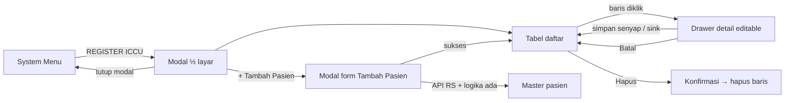

# Wireframe: REGISTER ICCU — Modal (½ layar) + Tabel + Drawer Detail (editable)

Dokumen ini **hanya wireframe & logika interaksi** (tanpa kode), konsisten dengan **model Jarvis putih (light)**: latar putih atau off-white bersih, panel “glass” sangat ringan, aksen cyan/teal halus (bukan neon di atas hitam), teks judul caps dengan kontras tegas di atas terang, bingkai modular tipis (corner ticks / garis holografik lembut), tipografi monospace untuk data, bayangan dan border halus menggantikan glow gelap.

---

## 1. Pemicu (konteks)

| Asal | Aksi pengguna | Hasil |
|------|---------------|--------|
| **System Menu** | Tap / klik item **REGISTER ICCU** | Membuka **modal REGISTER ICCU** (lebar ~50% viewport, tinggi penuh atau hampir penuh — “setengah layar” horizontal) |

**Catatan penempatan:** Modal menutupi bagian kanan (atau kiri) layar; sisi lain tetap terlihat **dim dengan overlay putih/transparan ringan** agar konteks “masih di intensive / dashboard” tidak hilang total.

---

## 2. State A — Modal REGISTER ICCU (default)

### 2.1 Struktur blok (atas → bawah)

```
┌────────────────────────────────────────────────────────────────────────────────────────────────────┐
│  [ JARVIS LIGHT FRAME: garis cyan tipis + corner ticks + panel putih ]                             │
│                                                                                                    │
│  REGISTER ICCU                                          [ × tutup ]   [ ⚙ ]                        │
│  ────────────────────────────────────────────────────────────────────────────                      │
│  SUBTITLE (opsional): DAFTAR PASIEN TERDAFTAR ICCU / FILTER RINGKAS                                │
│                                                                                                    │
│  [ + Tambah Pasien ]  [ Cari... ]  [ 📅 Kalender aktif ▼ ]  · sink otomatis (senyap)               │
│                                                                                                    │
│  ┌──────────────────────────────────────────────────────────────────────────────────────────────┐  │
│  │ TABEL · badan scroll ↑↓ & ↔ · tinggi area tabel tetap dalam modal                            │  │
│  │                                                                                              │  │
│  │ NO │ No. RM │ NO TELP │ NAMA PASIEN │ JK │ UMUR │ ALAMAT │ DIAGNOSA │ DOKTER DPJP │ AKSI     │  │
│  │----+--------+---------+-------------+----+------+--------+----------+-------------+----------│  │
│  │ 1  │ …      │ …       │ …           │ …  │ …    │ …      │ …        │ …           │ [Hapus]  │  │
│  │ … (baris lain di dalam area scroll) …                                                        │  │
│  │ ◀ Prev · Hal 1 / n · Next ▶    Per hal:  [25]  [50]  [100]    menampilkan 1–25 dari N        │  │
│  └──────────────────────────────────────────────────────────────────────────────────────────────┘  │
│                                                                                                    │
│  Footer: jumlah baris · sink otomatis · simpan senyap · hint: "Klik baris untuk detail"            │
└────────────────────────────────────────────────────────────────────────────────────────────────────┘
```

**Asal baris tabel:** contoh baris `1 │ …` di atas dapat muncul setelah pengguna menyelesaikan **Tambah Pasien** (§2.3): data mengisi kolom yang sudah tersedia dari master; **DIAGNOSA** / **DOKTER DPJP** dilengkapi kemudian di **drawer**.

**Sink & penyimpanan:** daftar memperbarui diri **secara otomatis** (tanpa tombol Refresh); perubahan dari drawer disimpan **senyap** (tanpa dialog sukses yang mengganggu), cukup indikator ringan bila perlu (mis. ikon/checklist di footer atau status bar).

**Kalender:** kontrol **📅 Kalender aktif** membuka **popover kalender** (pilih hari atau rentang); setelah dipilih, tabel **langsung** memakai filter tanggal tersebut (sink otomatis).

**Pagination & scroll:** badan tabel punya **scrollbar vertikal dan horizontal**; di bawahnya kontrol **halaman** (Prev/Next) dan pemilih **jumlah baris per halaman: 25, 50, atau 100**; teks ringkasan *menampilkan X–Y dari N* mengikuti pilihan tersebut.

### 2.2 Kolom tabel (wajib)

| Kolom | Keterangan wireframe |
|-------|----------------------|
| **NO** | Nomor urut daftar (bukan RM). |
| **No. RM** | Nomor rekam medis. |
| **NO TELP** | Kontak. |
| **NAMA PASIEN** | Teks utama baris. |
| **JENIS KELAMIN** | L/P atau label singkat. |
| **UMUR** | Angka + satuan (th/bln) sesuai kebijakan klinis. |
| **ALAMAT** | Potong ellipsis di tabel; lengkap di drawer. |
| **DIAGNOSA** | Ringkas di tabel; detail di drawer bila perlu. |
| **DOKTER DPJP** | Nama dokter penanggung jawab. |
| **AKSI** | Tombol **Hapus** (destructive, konfirmasi sebelum eksekusi). |

**Estetika:** header kolom all-caps kecil; baris zebra sangat halus atau **border/divider cyan-teal tipis** pada putih; hover baris: **highlight lembut** (mis. blok cyan sangat transparan) + kursor pointer (baris = selectable).

### 2.3 Tambah Pasien — modal form (reuse + API RS)

**Pemicu:** tombol **`[ + Tambah Pasien ]`** pada toolbar modal REGISTER ICCU.

**Reuse UI & logika:** dibuka modal **Tambah Pasien** yang **sama** dengan form pasien yang sudah ada di aplikasi (judul + ikon **+**, grid field, **Simpan** / **Batal**). Validasi, mapping **Jenis Pembiayaan** × **Kelas Perawatan**, helper teks agregat (mis. *disimpan sebagai PBI Kelas 3*), dan perilaku tombol mengikuti **logika modul yang sudah dipakai** — tidak mendefinisikan ulang aturan bisnis di wireframe ini.

**Integrasi API rumah sakit:** form dapat **memanggil API RS** yang sudah terpasang (lookup / kirim data sesuai kontrak integrasi); detail endpoint dan auth mengikuti implementasi terkini (sama dengan alur Tambah Pasien di modul master).

**Setelah simpan sukses (dual write):**

1. **Master pasien** — rekaman pasien tercatat / ter-update di **master pasien** (sumber kebenaran demografi & pembiayaan dasar).
2. **Tabel REGISTER ICCU** — **baris baru** otomatis muncul di daftar dalam modal (lihat baris contoh §2.1), dengan kolom terisi dari data yang tersedia (No. RM, nama, No. HP, JK, umur, alamat, dll.); kolom **DIAGNOSA** / **DOKTER DPJP** dapat dilengkapi kemudian lewat **drawer** atau alur ICCU.

**Penghapusan baris ICCU** tidak menghapus master pasien kecuali produk secara eksplisit mengikat kedua domain — default wireframe: hapus hanya **pembatalan registrasi ICCU** / unlink dari daftar, bukan penghapusan master.

#### Wireframe ringkas form Tambah Pasien (selaras screenshot modul)

```
┌──────────────────────────────────────────────────────────────┐
│  +  TAMBAH PASIEN                                    [ × ]   │
├──────────────────────────────────────────────────────────────┤
│  No. RM [____________]     Nama [________________________]   │
│  Jenis Kelamin [ Laki-laki ▼ ]   Tgl lahir [ YYYY-MM-DD … ]  │
│                                  Umur [ — / auto ]           │
│  Alamat [______________________________________________]     │
│  No. HP [_____________________]                              │
│  Jenis Pembiayaan [ BPJS-PBI ▼ ]   Kelas perawatan [ 3 ▼ ]   │
│  (helper: disimpan sebagai agregat kelas/pembiayaan…)          │
│  Asuransi (opsional) [________________________]              │
├──────────────────────────────────────────────────────────────┤
│  [ Simpan ]                      [ Batal ]                   │
└──────────────────────────────────────────────────────────────┘
```

*Tema visual mengikuti komponen yang ada (contoh screenshot: form gelap); di modal REGISTER ICCU Jarvis light, form dapat tetap memakai skin modul Pasien agar konsisten dengan perilaku yang dikenal pengguna.*

---

## 3. State B — Tabel kosong

- Area tabel menampilkan **empty state** bergaya Jarvis light: ikon garis tipis + teks “Belum ada data” + CTA **`+ Tambah Pasien`** (membuka form §2.3).
- **Klik baris** tidak aktif sampai ada data.

---

## 4. State C — Klik baris → Drawer detail (editable)

### 4.1 Perilaku

| Kondisi | Perilaku |
|---------|----------|
| Baris memiliki data | **Klik di mana saja pada baris** (kecuali area tombol Hapus — lihat §4.3) membuka **drawer** dari sisi yang tidak bentrok dengan modal (mis. drawer dari **kanan** jika modal di kiri, atau sebaliknya). |
| Drawer terbuka | Baris terpilih diberi **highlight** (outline atau pill aksen cyan-teal di tema terang). |
| Edit | Field di drawer **editable** (input/select/textarea); **Simpan senyap** saat keluar field / debounce (tanpa toast besar); **Batal** mengembalikan draf bila ada perubahan belum tertulis; tabel di modal ikut **sink otomatis**. |

### 4.2 Wireframe drawer — header + sidebar ikon + tab navigasi

Drawer memakai **bilah atas (header kontekstual)** + **sidebar vertikal ber-ikon** untuk ganti tab; panel kanan menampilkan field tab yang aktif. **Simpan senyap** tetap berlaku (§4.1).

```
┌──────────────────────────────────────────────────────────────────────────────────────────────────────────────────────────────────────────────────────┐
│ HEADER                 │ Jumat, 24 April 2026  08:07:31   SUMIN MARIYATI   [Diagnosa]   [ikon salin]                                            [ × ]│
├────────────────────────┬─────────────────────────────────────────────────────────────────────────────────────────────────────────────────────────────┤
│ (ikon) sidebar         │ Kiri: navigasi tab (ikon). Kanan: formulir — satu layar, scroll vertikal jika perlu.                                        │
│                        │                                                                                                                             │
│────────────────────────│ ════════════════════  BAGIAN: DATA PASIEN  ════════════════════════════════════════════════════════════════════             │
│  [👤]                   │ NAMA PASIEN           [ ______________________________________________________________________________ ]                    │
│  PASIEN                │ NO TELP / WhatsApp    [ angka saja ]     [ buka WhatsApp ]                                                                  │
│                        │ JENIS KELAMIN         [  L / P  ▼  ]                                                                                        │
│                        │ TGL LAHIR             [ 18-12-1974 · tempel dd-mm-yyyy ]  [📅]   UMUR (otomatis)  [ auto ]                                   │
│                        │ ALAMAT                [ multiline ________________________________________________________________________________ ]        │
│                        │ ASAL PASIEN           [ ▼ IGD · POLI · RUJUKAN · OK · CATHLAB · RAWAT INAP (master ruangan) · … ]                           │
│                        │ (helper: RAWAT INAP dari master ruangan)                                                                                    │
│────────────────────────│ ════════════  SIDEBAR: DOKTER & DIAGNOSA  [👨‍⚕️]  ════════════════════════════════════════════════════════════              │
│  [👨‍⚕️]                │ DOKTER DPJP           [ ▼ pilih dari master dokter — autofill / cari _____________________________________________________ ]│
│  DOKTER                │ DIAGNOSA (multiline)  [ ________________________________________________________________________________ ]                  │
│  & DIAGNOSA            │                       [ ________________________________________________________________________________ ]                  │
│────────────────────────│ ════════════  SIDEBAR: TINDAKAN INVASIF  [🔬]  ═════════════════════════════════════════════════════════════                 │
│  [🔬]                   │ [ ] VENTILATOR [ ] NIV       [ ] HFNC      [ ] CVC                                                                          │
│  TINDAKAN INVASIF      │ [ ] PDT       [ ] DCA       [ ] PTCA      [ ] TPM                                                                           │
│                        │ [ ] PPM  [ ] PERICARDIOSINTESIS [ ] ABLASI [ ] STREPTASE                                                                    │
│────────────────────────│ ════════════  BAGIAN: CARA PEMBAYARAN  [💳]  ════════════════════════════════════════════════════════════════                │
│                        │ (isi tab di produk: UMUM · PBI · NPBI / R · JKS · ASURANSI — komponen mengikuti master)                                     │
│                        │ KETERANGAN            [ ______________________________________________________________________________ ]                    │
│────────────────────────│ ════════════════════  BAGIAN: PERIODE RAWAT  [📅]  ════════════════════════════════════════════════════════════              │
│  [📅]                   │ Masuk                 [ 01/01/2026 ]   [📅 kalender]                                                                         │
│  PERIODE RAWAT         │ Keluar                [ 05/01/2026 ]   [📅 kalender]                                                                         │
│                        │ Total hari (LOS)      [ 4 hari ]   (otomatis dari selisih atau override manual)                                             │
│────────────────────────│ ════════════  SIDEBAR: CARA KELUAR  [🚪]  ═══════════════════════════════════════════════════════════════════                │
│  [🚪]                   │ ( ) Pindah Ruangan    [ ▼ pilih dari master ruangan ______________________________________________________________________ ]│
│  CARA KELUAR           │ ( ) KRS / Pulang                                                                                                            │
│                        │ ( ) Pulang Paksa                                                                                                            │
│                        │ ( ) Rujuk                                                                                                                   │
│                        │ ( ) Meninggal         ( ) < 48 jam              ( ) > 48 jam                                                                │
├────────────────────────┴─────────────────────────────────────────────────────────────────────────────────────────────────────────────────────────────┤
│ FOOTER                 │ [ Batal ]  · simpan otomatis (senyap)                                                                                       │
└──────────────────────────────────────────────────────────────────────────────────────────────────────────────────────────────────────────────────────┘
```

**Header:** tanggal & waktu (contoh **Jumat, 24 April 2026 08:07:31**), **nama pasien** capslock/tegas, chip atau tautan **[Diagnosa]** (buka ringkasan / lompat ke tab Dx), **ikon salin** (salin identitas ringkas / RM ke clipboard — perilaku mengikuti produk).

**Sidebar (ikon + label pendek):** klik ikon mengganti **fokus** tab; **kolom navigasi kiri** dalam cuplikan ASCII dibuat **lebar** (±24 karakter) agar label sidebar (**PERIODE RAWAT**, **TINDAKAN INVASIF**, **CARA KELUAR**, **& DIAGNOSA**, dll.) terbaca utuh; kotak keseluruhan **±152 kolom**. Di **satu wireframe** di atas: blok **DATA PASIEN** memuat **ASAL PASIEN** dan baris **helper** master ruangan; **tepat di bawahnya** **SIDEBAR: DOKTER & DIAGNOSA** **[👨‍⚕️]** (DPJP + Diagnosa), lalu **TINDAKAN INVASIF** **[🔬]**; **BAGIAN: CARA PEMBAYARAN** (**[💳]** di judul saja, **tanpa** sidebar **BAYAR**), isi cara bayar, dan **KETERANGAN**; **[📅] PERIODE RAWAT**; **SIDEBAR: CARA KELUAR** **[🚪]**. Secara produk, saat hanya tab PERIODE yang dipilih, panel kanan boleh **hanya** menampilkan blok tanggal tersebut; cuplikan ASCII menggabungkan alur agar mudah dibaca.

| Tab (ikon) | Isi field (wireframe) |
|------------|------------------------|
| **PASIEN** | **NAMA PASIEN**, **NO TELP / WhatsApp**: input **hanya angka** (normalisasi ke format kontak); **terhubung WA** — indikator atau **tombol buka WhatsApp** (deep link `wa.me` / API resmi) saat nomor valid; **JENIS KELAMIN**; **TGL LAHIR**: isi dengan **menempel** teks tanggal **dd-mm-yyyy** (contoh **18-12-1974**) dan/atau **memilih tanggal lewat kalender** (ikon popover); **UMUR** mengisi **otomatis** dari TGL LAHIR; **ALAMAT**; **ASAL PASIEN** [dropdown]: **IGD**, **POLI**, **RUJUKAN**, **OK**, **CATHLAB**, **RAWAT INAP** (opsi **RAWAT INAP** disuplai dari **master ruangan**). **KETERANGAN** dalam cuplikan berada **setelah** baris isi cara bayar (urutan cuplikan: ASAL → helper → **DOKTER & DIAGNOSA** → **TINDAKAN INVASIF** → cara bayar → KETERANGAN → PERIODE → **CARA KELUAR**). |
| **[📅] PERIODE RAWAT** | **Masuk** (contoh **01/01/2026**), **Keluar** (contoh **05/01/2026**), **Total** hari (contoh **4 hari**) — total dari **selisih tanggal** atau boleh **override** sesuai kebijakan; pemilihan tanggal dapat memakai **kalender** seperti field tanggal lain. |
| **CARA KELUAR** | Satu pilihan utama (radio): **Pindah Ruangan** dengan **[ ▼ pilih dari master ruangan ]**; **KRS / Pulang**; **Pulang Paksa**; **Rujuk**; **Meninggal** dengan sub-pilihan **< 48 jam** atau **> 48 jam** — selaras cuplikan **SIDEBAR: CARA KELUAR** di drawer. |
| **DOKTER DPJP & DIAGNOSA** | **DOKTER DPJP** [dropdown dengan **autofill / sumber master dokter**]; **DIAGNOSA** [field teks atau multiline]. |
| **CARA PEMBAYARAN** | Pilihan cara bayar selaras master: **UMUM**, **PBI**, **NPBI** (termasuk varian **R** bila dipakai), **JKS**, **ASURANSI** — penyajian segmented / radio / dropdown mengikuti komponen yang ada. Pada cuplikan, blok ini (plus **KETERANGAN** di baris berikutnya) berada **setelah** **DOKTER & DIAGNOSA** dan **TINDAKAN INVASIF**, **sebelum** PERIODE (tanpa label sidebar **BAYAR**). |
| **TINDAKAN INVASIVE** | **Checkbox** invasive (boleh banyak): **VENTILATOR**, **NIV**, **HFNC**, **CVC**, **PDT**, **DCA**, **PTCA**, **TPM**, **PPM**, **PERICARDIOSINTESIS**, **ABLASI**, **STREPTASE** — selaras cuplikan sidebar drawer; field tambahan (tanggal, catatan, dll.) mengikuti modul tindakan / cath bila diperlukan. |

**Relasi ke tabel modal:** kolom **NO, No. RM, NO TELP, NAMA, JK, UMUR, ALAMAT, DIAGNOSA, DOKTER DPJP** terisi dari tab **PASIEN** + **DOKTER & DIAGNOSA**; tab **[📅] PERIODE RAWAT** menyimpan konteks **perawatan / LOS** untuk ICCU (boleh disinkron ke ringkasan kasus atau laporan) tanpa menggantikan kolom tabel utama kecuali produk memetakan eksplisit.

### 4.3 Konflik klik: baris vs Hapus

| Area klik | Hasil |
|-----------|--------|
| Sel tabel (data) | Buka / fokus **drawer** detail. |
| Tombol **Hapus** | **Stop propagation**: hanya memicu alur hapus (dialog konfirmasi), tidak membuka drawer. |

---

## 5. Diagram alur (ringkas)



---

## 6. Layering & aksesibilitas (catatan desain)

- **Modal** di atas konten utama; **modal Tambah Pasien** di atas modal REGISTER ICCU saat form dibuka; **drawer** di atas modal (stacking jelas agar tidak “nyangkut” di belakang).
- **Focus trap:** saat drawer terbuka, tab order tetap di drawer sampai ditutup.
- **Kontras:** teks primer **gelap pada dasar putih** (mis. slate/neutral tajam); label aksi **Hapus** tetap terbaca (merah destructive + border halus, hindari merah pudar di atas putih).

---

## 7. Ringkasan interaksi (checklist produk)

- [ ] Klik **REGISTER ICCU** → modal **REGISTER ICCU** ~50% lebar layar, **tema Jarvis putih (light)**.
- [ ] **`+ Tambah Pasien`** membuka **form reuse** (field & logika sama modul Pasien); **API RS** sesuai integrasi; simpan → **master pasien** + **baris baru** di tabel ICCU (sink).
- [ ] Tabel berkolom: NO, No. RM, NO TELP, NAMA PASIEN, JENIS KELAMIN, UMUR, ALAMAT, DIAGNOSA, DOKTER DPJP, AKSI (Hapus); **scroll** vertikal & horizontal pada badan tabel; **pagination** (Prev/Next) + **per halaman 25 / 50 / 100**; **sink daftar otomatis** (tanpa Refresh).
- [ ] Klik **baris** (data terisi) → **drawer** dengan **header** (tgl/jam, nama, Diagnosa, salin) + **sidebar tab ber-ikon** (Pasien, Dokter & Dx, Pembayaran, Tindakan invasive); penyimpanan **senyap** + **Batal**; tabel **tanpa tombol Refresh**.
- [ ] Klik **Hapus** → konfirmasi, tidak membuka drawer.
- [ ] Tutup modal mengembalikan ke System Menu / view sebelumnya tanpa orphan drawer.

---

*File ini dapat disalin ke figma/whiteboard sebagai acuan layout; revisi kolom atau field ICCU tambahan bisa ditambahkan di §4.2.*
