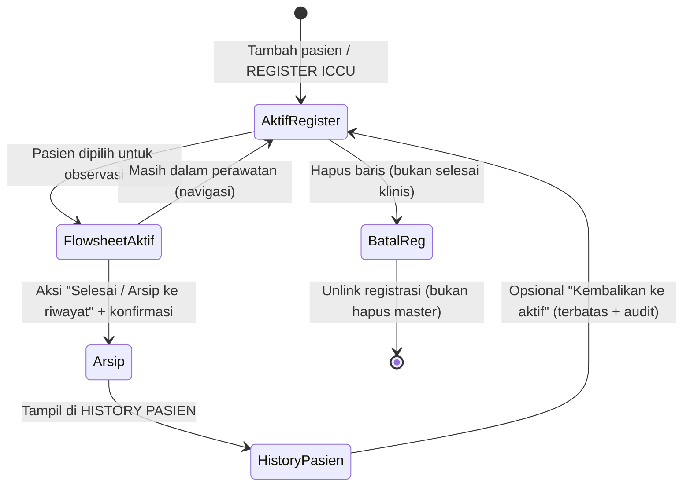
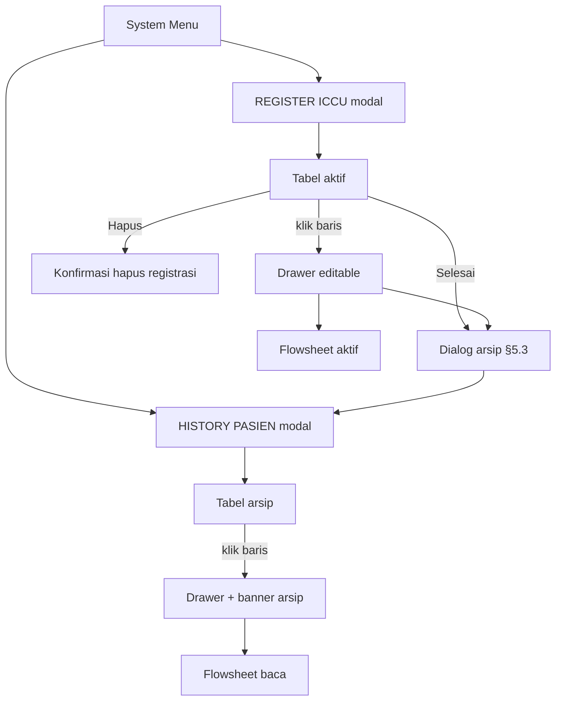

# Wireframe: Register aktif → Flowsheet → History pasien (Intensive / ICCU)

Dokumen ini **hanya wireframe & logika interaksi** (tanpa kode), melanjutkan narasi [diskusi register → history](./diskusi-register-ke-history-pasien-intensive.md). Estetika mengikuti **Jarvis putih (light)** seperti [wireframe REGISTER ICCU](./wireframe-register-iccu-modal-drawer.md): panel terang, aksen cyan/teal halus, monospace untuk data.

---

## 1. Tujuan & ruang lingkup

| Tujuan | Keterangan |
|--------|------------|
| **Daftar aktif** | **REGISTER ICCU** hanya menampung pasien yang masih dalam siklus observasi intensive + flowsheet aktif. |
| **Penutupan** | Setelah **status / cara keluar** disepakati, petugas menjalankan aksi **arsip** — pasien **keluar** dari register aktif tanpa menghapus jejak flowsheet. |
| **Riwayat** | **HISTORY PASIEN** menampilkan kasus yang sudah diarsipkan; flowsheet dan metadata tetap dibaca (dan diedit terbatas sesuai kebijakan). |

**Bukan cakupan:** aturan klinis detail (siapa yang boleh menutup kasus); itu kebijakan rs — wireframe hanya menyiapkan **alur UI** dan **beda semantik aksi**.

---

## 2. Referensi silang

| Dokumen / aset | Peran |
|----------------|--------|
| [Diskusi register → history](./diskusi-register-ke-history-pasien-intensive.md) | Narasi operasional, glosarium, open questions. |
| [Wireframe REGISTER ICCU (modal + drawer)](./wireframe-register-iccu-modal-drawer.md) | Layout modal ½ layar, tabel, drawer editable, **Hapus** = pembatalan registrasi. |
| `components/intensive/iccu/IccuRegisterModal.tsx` | Implementasi aktual; produk dapat memakai **satu shell modal** dengan tab / mode **Aktif | Riwayat** atau **dua pintu** terpisah di System Menu. |

---

## 3. Diagram siklus hidup (ringkas)



---

## 4. Pemicu (System Menu)

| Asal | Aksi pengguna | Hasil |
|------|---------------|--------|
| **System Menu** | **REGISTER ICCU** | Modal **daftar aktif** (lihat §5). |
| **System Menu** | **HISTORY PASIEN** | Modal **daftar arsip** (lihat §6). |
| Dashboard / kartu pasien | Buka **flowsheet** | Konteks observasi; tautan balik ke register aktif bila pasien masih aktif. |

**Catatan implementasi:** kedua modal boleh berbagi **komponen tabel + drawer** dengan prop `mode: 'active' | 'history'` agar perilaku simpan/banner berbeda tanpa menduplikasi layout.

---

## 5. Modal REGISTER ICCU (delta perilaku — selaras diskusi)

Struktur visual mengikuti §2 [wireframe REGISTER ICCU](./wireframe-register-iccu-modal-drawer.md). Di bawah ini **hanya tambahan** yang mendukung transisi ke history.

### 5.1 Toolbar — tambahan opsional

```
  …  [ + Tambah Pasien ]  [ Cari... ]  [ 📅 Kalender aktif ▼ ]   |   hint: "Baris = detail · Selesai = arsip"
```

### 5.2 Kolom AKSI — dua jalur yang harus dibedakan

| Kontrol | Semantik wireframe | Konfirmasi | Efek data (konsep) |
|---------|-------------------|------------|---------------------|
| **[Hapus]** | **Pembatalan registrasi ICCU** / salah input daftar — *bukan* penutupan klinis | Dialog singkat: "Hapus dari daftar ICCU?" | Baris hilang dari **aktif**; master pasien default **tetap**; flowsheet: kebijakan produk (blok vs orphan) harus eksplisit di luar wireframe. |
| **[Selesai]** atau **[Arsip]** | **Penutupan observasi** — pindah ke **HISTORY PASIEN** | Dialog **§5.3** (wajib) | Status registrasi → **historical**; flowsheet **tertutup untuk entri baru** atau **read-only** sesuai kebijakan; baris hilang dari tabel aktif. |

**UX:** warna/warna tombol berbeda — **Hapus** = destructive merah; **Selesai / Arsip** = netral atau aksen sekunder (bukan merah) agar tidak tertukar.

### 5.3 Dialog konfirmasi — "Selesai observasi & arsip"

```
┌─────────────────────────────────────────────────────────────────┐
│  Selesai observasi ICCU                                   [ × ] │
├─────────────────────────────────────────────────────────────────┤
│  Pasien: SUMIN MARIYATI  ·  RM: ______                          │
│                                                                 │
│  Cara keluar (ringkas): [ KRS / Pulang ▼ ]   (baca dari drawer) │
│  Tanggal keluar:        [ 24/04/2026 ]                          │
│                                                                 │
│  ☑ Saya mengonfirmasi observasi di flowsheet telah lengkap      │
│    sesuai protokol ruangan (opsional — centang kebijakan RS).   │
│                                                                 │
│  Ringkasan: pasien akan dipindahkan ke HISTORY PASIEN.          │
│  Data observasi tidak dihapus.                                  │
├─────────────────────────────────────────────────────────────────┤
│  [ Batal ]                         [ Konfirmasi & arsip ]       │
└─────────────────────────────────────────────────────────────────┘
```

**Sumber field:** idealnya **Cara keluar** dan **tanggal keluar** sudah terisi di **drawer** (tab CARA KELUAR / PERIODE); jika kosong, dialog menampilkan **peringatan** dan tombol utama disabled atau memaksa mini-form di dialog.

**Setelah sukses:** toast ringan "Pasien dipindahkan ke riwayat" + daftar aktif **sink**; opsi **Undo** sangat pendek (mis. 5–10 d) hanya untuk **membatalkan arsip** jika produk mendukung — lihat diskusi undo menu vs undo data.

### 5.4 Alternatif pemicu dari drawer

Di **footer drawer** (mode aktif), selain perilaku simpan senyap:

```
│ FOOTER  │  [ Batal ]  ·  simpan otomatis (senyap)  ·  [ Selesai & arsip… ]  │
```

**Klik** `[ Selesai & arsip… ]` membuka dialog **§5.3** yang sama (satu sumber kebenaran alur).

### 5.5 Wireframe tabel aktif (cuplikan dengan kolom baru)

```
│  │ NO │ No. RM │ … │ DOKTER DPJP │ AKSI                              │
│  │----+--------+---+-------------+-----------------------------------│
│  │ 1  │ …      │ … │ …           │ [ Selesai ]  [ Hapus ]            │
```

*Jika lebar terbatas:* **Selesai** sebagai ikon dengan tooltip + menu overflow.

---

## 6. Modal HISTORY PASIEN (daftar arsip)

### 6.1 Struktur blok (atas → bawah)

```
┌────────────────────────────────────────────────────────────────────────────────────────────────────┐
│  [ JARVIS LIGHT FRAME ]                                                                            │
│                                                                                                    │
│  HISTORY PASIEN                                         [ × tutup ]   [ ⚙ ]                        │
│  ────────────────────────────────────────────────────────────────────────────                      │
│  SUBTITLE: RIWAYAT OBSERVASI ICCU — TIDAK MEMAKAI DAFTAR AKTIF                                     │
│                                                                                                    │
│  [ Cari… RM / nama ]   [ 📅 Rentang tanggal ▼ ]   [ Cara keluar: Semua ▼ ]   · sink otomatis      │
│                                                                                                    │
│  ┌──────────────────────────────────────────────────────────────────────────────────────────────┐  │
│  │ TABEL · scroll ↑↓ & ↔                                                                        │  │
│  │ NO │ No. RM │ NAMA │ JK │ UMUR │ TGL MASUK │ TGL KELUAR │ CARA KELUAR │ DPJP │ AKSI          │  │
│  │----+--------+------+----+------+-----------+------------+-------------+------+---------------│  │
│  │ 1  │ …      │ …    │ …  │ …    │ …         │ …          │ KRS         │ …    │ [ Buka ]    │  │
│  │ …                                                                                            │  │
│  │ ◀ Prev · Hal 1 / n · Next ▶    Per hal:  [25]  [50]  [100]                                   │  │
│  └──────────────────────────────────────────────────────────────────────────────────────────────┘  │
│                                                                                                    │
│  Footer: jumlah arsip · "Klik baris untuk detail & flowsheet (baca)"                               │
└────────────────────────────────────────────────────────────────────────────────────────────────────┘
```

### 6.2 Perilaku baris & drawer

| Kondisi | Perilaku |
|---------|----------|
| Klik baris | Buka **drawer** dengan **banner** abu-abu halus: **MODE ARSIP — observasi tertutup**. |
| Field di drawer | Default **read-only**; subset field (mis. koreksi administratif) boleh editable jika kebijakan mengizinkan — simpan senyap + **audit**. |
| Tombol **Buka flowsheet** | Di header drawer atau toolbar: navigasi ke **flowsheet** dalam mode **baca** (atau sama dengan aktif jika produk tidak membedakan). |
| **AKSI [ Buka ]** | Ekuivalen klik baris (aksesibilitas / mobile). |

### 6.3 Koreksi — "Kembalikan ke register aktif" (opsional)

| Konteks | Wireframe |
|---------|-----------|
| Tombol sekunder di drawer arsip | `[ Kembalikan ke daftar aktif… ]` hanya untuk peran tertentu. |
| Dialog | Menjelaskan dampak: pasien kembali muncul di **REGISTER ICCU**, status arsip dibatalkan, **log audit** wajib. |

Jika fitur ini **tidak** dirilis, sembunyikan tombol; cukup catat di backlog dari [open questions diskusi](./diskusi-register-ke-history-pasien-intensive.md).

---

## 7. Flowsheet (ikatan konsep)

| Mode pasien | Flowsheet |
|-------------|-----------|
| **Aktif** di REGISTER ICCU | Entri observasi **normal** (sesuai modul intensive / `tindakanId`). |
| **Arsip** di HISTORY PASIEN | Tampilan **read-only** default; indikator visual "kasus tertutup" di header flowsheet. |

Transisi **aktif → arsip** harus memicu **refresh** picker pasien di flowsheet agar pasien tidak tetap terpilih sebagai "aktif" tanpa sengaja.

---

## 8. Diagram alur UI (gabungan)



---

## 9. Layering & hygsi overlay

- Urutan tumpukan sama seperti [wireframe REGISTER ICCU §6](./wireframe-register-iccu-modal-drawer.md): dialog konfirmasi arsip **di atas** modal register; drawer **di atas** modal.
- Hindari beberapa lapisan blur bersamaan; overlay solid ringan pada tema terang.

---

## 10. Checklist produk (register → history)

- [ ] **REGISTER ICCU**: aksi **Hapus** dan **Selesai/Arsip** **tidak** dapat saling menggantikan; copy dialog berbeda.
- [ ] **Selesai/Arsip** membutuhkan **cara keluar** (dan tanggal keluar) yang valid sebelum konfirmasi.
- [ ] Setelah arsip, baris **langsung** hilang dari tabel aktif dan muncul di **HISTORY PASIEN** (dengan jeda sink yang dapat diterima).
- [ ] **HISTORY PASIEN**: filter **rentang tanggal** + **cara keluar** + pencarian RM/nama.
- [ ] Drawer arsip: **banner mode arsip** + akses **flowsheet** dalam mode sesuai kebijakan.
- [ ] Flowsheet tidak membiarkan entri "aktif" pada pasien yang sudah diarsip (atau memperingatkan keras).
- [ ] (Opsional) **Kembalikan ke aktif** dengan peran + audit.
- [ ] Dokumentasi internal: beda **hapus registrasi** vs **arsip klinis** dilatih ke perawat.

---

*Revisi kolom tabel history, teks pastori, dan kebijakan edit arsip dapat ditambahkan di §6 tanpa mengubah §5.*
